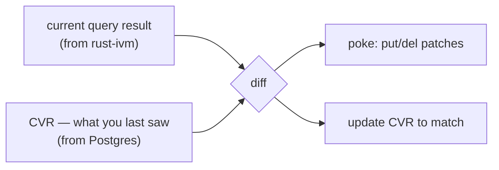
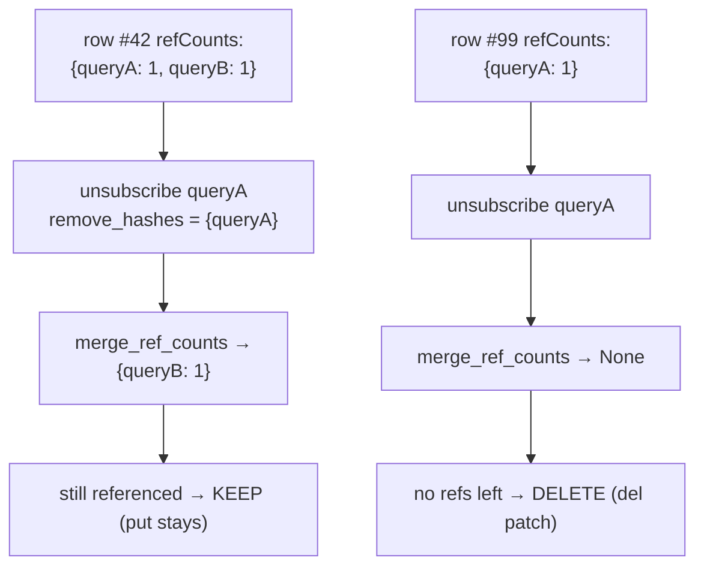
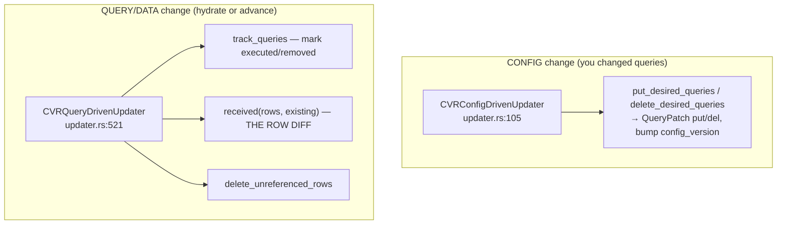
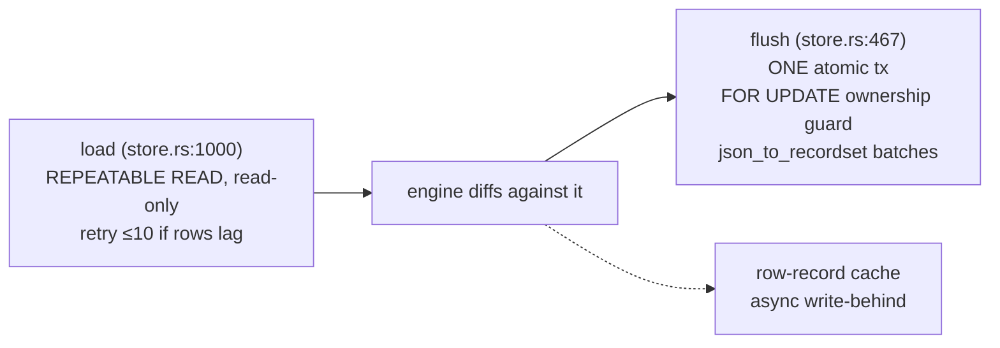
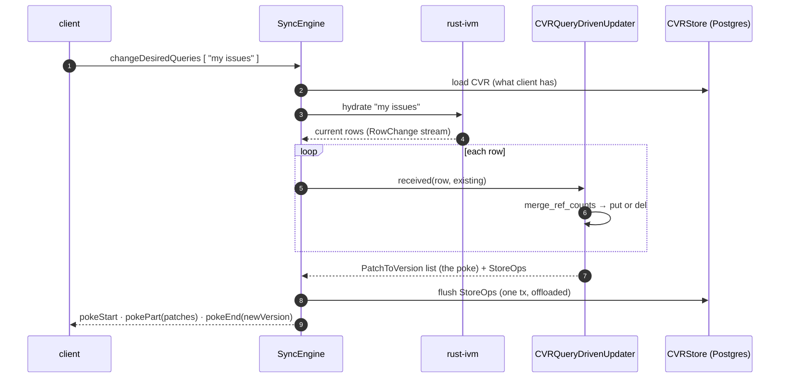

# rust-cvr — The Client View Record, Deep Dive

> **Companion to** [`RUST-SYNCER-ARCHITECTURE.md`](./RUST-SYNCER-ARCHITECTURE.md) and [`RUST-SYNCER-DB-AND-OFFLOAD.md`](./RUST-SYNCER-DB-AND-OFFLOAD.md).
> The syncer deep-dive explains *how a request flows*. This doc explains *how the server decides what to send* — the CVR, the single most conceptually important idea in the whole engine.
>
> Branch `rust-cvr-v1.0.0`. Line numbers are anchors; grep the named symbol if one moved.

---

## Table of contents

1. [What a CVR is (the intuition)](#1-what-a-cvr-is-the-intuition)
2. [The CVR data structure](#2-the-cvr-data-structure)
3. [Versions — the client's bookmark](#3-versions--the-clients-bookmark)
4. [refCounts — why a row is or isn't in your view](#4-refcounts--why-a-row-is-or-isnt-in-your-view)
5. [Patches — the language of a poke](#5-patches--the-language-of-a-poke)
6. [The updaters — how a diff is computed](#6-the-updaters--how-a-diff-is-computed)
7. [StoreOps — recording intent](#7-storeops--recording-intent)
8. [Persistence — the Postgres store](#8-persistence--the-postgres-store)
9. [Row keys](#9-row-keys)
10. [Putting it together: one hydrate](#10-putting-it-together-one-hydrate)
11. [Gotchas worth knowing](#11-gotchas-worth-knowing)

---

## 1. What a CVR is (the intuition)

Imagine a streaming service that has to keep your screen in sync with a database that's constantly changing. Every time something changes, it *could* re-send your entire view — but that's wasteful. Instead it needs to remember **exactly what it last showed you**, so it can send only the difference.

That memory is the **Client View Record (CVR)**. One CVR per client group. It is the server's answer to the question:

> *"What rows and queries does this client currently believe it has, and at what version?"*

The engine computes the query result **now** (via IVM), looks up **what you last saw** (the CVR), and the **difference is the poke**. Then it updates the CVR to match what it just sent you.



**Analogy:** the CVR is a **receipt**. It lists every item you've been given and the version stamp. When the store restocks, the clerk compares the shelf to your receipt, hands you only what's new or changed, and updates your receipt. It never re-hands you the whole cart.

The CVR lives in **Postgres** (shared, durable) so that if you disconnect and reconnect — even to a different server instance — the new server can read your receipt and catch you up instead of re-sending everything.

---

## 2. The CVR data structure

The in-memory `CVR` (`types.rs:200`):

```rust
pub struct CVR {
    pub id: String,                              // == client group id
    pub version: CVRVersion,                     // the current bookmark (see §3)
    pub last_active: i64,
    pub ttl_clock: TTLClock,
    pub replica_version: Option<String>,
    pub clients:  BTreeMap<String, ClientRecord>,   // the clients (tabs) in this group
    pub queries:  BTreeMap<String, QueryRecord>,    // every query being served
    pub client_schema: Option<ClientSchema>,
    pub profile_id: Option<String>,
}
```

Three maps carry the weight:

- **`clients`** — the individual clients (browser tabs) that make up this group, and which queries each one *desires*.
- **`queries`** — every query currently served to the group. A `QueryRecord` is one of three kinds:
  - `Client` — a normal ZQL query (carries its AST),
  - `Custom` — a named/parameterized query (carries `name` + `args`),
  - `Internal` — engine-managed queries like `lmids` and `mutationResults` (`cvr.rs:316`).
- **the rows** — *not* stored inline in the `CVR` struct. Rows live in the **row-record cache** and Postgres `rows` table (see §8), because there can be a huge number of them and they're diffed separately.

So the `CVR` struct is the **config skeleton** (who, which queries, what version); the **row set** is the bulk data, tracked alongside via refCounts.

---

## 3. Versions — the client's bookmark

Every poke moves the client from one version to the next. A `CVRVersion` (`version.rs:23`) has two parts:

```rust
pub struct CVRVersion {
    pub state_version: String,        // "00", "01", ...  — bumped when DATA advances
    pub config_version: Option<u64>,  // bumped when CONFIG changes (queries added/removed)
}
```

- **`state_version`** advances when the underlying **data** changes (an *advance*). It's a lexicographically-ordered string (base36-ish), so `"01" < "02" < ... < "0z" < "10"`.
- **`config_version`** advances when the **set of queries/clients** changes (a *hydrate/config update*), without the data itself moving.

Serialized to a cookie it looks like `"01"` or `"01:5"` (`stateVersion[:configVersion]`). This cookie is what the client stores and echoes back on reconnect, so the server knows where to resume.

### The one subtlety that bites people

Comparing versions is **not** the derived `==`. Use `cmp_cvr` (`version.rs:68`):

```rust
pub fn cmp_cvr(a: &CVRVersion, b: &CVRVersion) -> Ordering {
    a.state_version.cmp(&b.state_version)
        .then_with(|| a.config_version.unwrap_or(0).cmp(&b.config_version.unwrap_or(0)))
        //                            ^^^^^^^^^^^^ None counts as 0 for ORDERING
}
```

But the derived `PartialEq`/`Eq` treats `config_version: None` and `Some(0)` as **different**. So `None` and `Some(0)` are **equal for ordering** but **unequal for equality**. That's why `CVRVersion` deliberately does **not** implement `Ord` — an `Ord` consistent with `cmp_cvr` would violate the `Ord`/`Eq` contract against the derived `Eq`. Always order with `cmp_cvr`/`cmp_versions`, never with `<`.

> **Intuition:** two counters. One ticks when the world changes (state), one ticks when your subscription changes (config). Together they're a total order over "everything the client has seen."

---

## 4. refCounts — why a row is or isn't in your view

This is the cleverest idea in the CVR, and the one to really understand.

**The problem:** the same row can be pulled in by *multiple* queries. If query A ("my issues") and query B ("recently updated") both return issue #42, and you then unsubscribe from A, should #42 disappear? **Only if B doesn't still want it.** The server needs to know *how many of your queries reference each row*.

**The solution:** every row in your view carries a **`refCounts`** map: `query_hash → count`. A row is in your view iff **at least one** query references it (count > 0). Unsubscribing from a query decrements its contribution; when the total hits zero, the row is deleted from your view.

The whole thing hinges on one pure function, `merge_ref_counts` (`cvr.rs:27`) — this is the heart of the CVR:

```rust
pub fn merge_ref_counts(
    existing: Option<&RefCounts>,                          // what the row had
    received: Option<&RefCounts>,                          // new contributions this cycle
    remove_hashes: Option<&HashSet<String>>,               // queries being removed
) -> Option<RefCounts> {                                   // None => delete the row
    let mut merged: RefCounts = BTreeMap::new();
    // 1. carry over existing counts, skipping any query in remove_hashes
    for (hash, count) in existing.into_iter().flatten() {
        if remove_hashes.map_or(false, |rh| rh.contains(hash)) { continue; }
        let val = merged.get(hash).copied().unwrap_or(0) + count;
        if val == 0 { merged.remove(hash); } else { merged.insert(hash.clone(), val); }
    }
    // 2. add received counts
    for (hash, count) in received.into_iter().flatten() {
        let val = merged.get(hash).copied().unwrap_or(0) + count;
        if val == 0 { merged.remove(hash); } else { merged.insert(hash.clone(), val); }
    }
    // 3. row survives iff SOME query still references it
    if merged.values().any(|&v| v > 0) { Some(merged) } else { None }
}
```



> **Intuition:** every row is a shared library book. Each query that wants it is a borrower. The book stays on your shelf while anyone's still borrowing it; it's returned only when the last borrower gives it up. `merge_ref_counts` is the borrower-count bookkeeping.

(One documented parity note: this Rust version drops literal-zero entries where TS retains them — benign, no functional impact. See the parity doc.)

---

## 5. Patches — the language of a poke

The output of a diff is a list of **patches** (`types.rs:214`). A poke is just a batch of these:

```rust
pub enum Patch {
    Row(RowPatch),     // a row appeared / changed / left your view
    Query(QueryPatch), // a query started / stopped being served
}

pub enum RowPatch {
    Put { id: RowID, contents: Arc<Value> },  // here's row X's data
    Del { id: RowID },                         // drop row X
}

pub enum QueryPatch {
    Put { id: String, client_id: Option<String> },  // query is now active
    Del { id: String, client_id: Option<String> },  // query is gone
}
```

Note `contents: Arc<Value>` — row data is reference-counted, not deep-copied, so the same row body shared across clients costs one allocation. Each patch is tagged with the version it moves you to (`PatchToVersion`, `:253`), so the client applies them in order and lands on a known bookmark.

> **Intuition:** a poke is a **diff/patch file** for your view. `put` = add-or-update these lines, `del` = remove these lines, and the version is the commit hash you end up on.

---

## 6. The updaters — how a diff is computed

Computing the diff and updating the CVR is done by **updaters** (`updater.rs`). There are two, matching the two ways your view can change:



- **`CVRConfigDrivenUpdater`** handles *"the client wants different queries."* It compares desired-vs-current, marks queries needed/inactive, bumps the **config** version, and emits `QueryPatch`es.
- **`CVRQueryDrivenUpdater`** handles *"the data was hydrated/advanced."* Its core is `received(rows, existing_rows)` (`:718`): for each new row it calls `merge_ref_counts` against the existing CVR row, deciding put-vs-del and whether the row version changed. `delete_unreferenced_rows` (`:855`) then reaps rows whose queries went away.

Both updaters collect their intended writes as **StoreOps** (next section) and produce `PatchToVersion` lists (the poke). The `SyncEngine` calls them; see [Architecture §7](./RUST-SYNCER-ARCHITECTURE.md#7-the-syncengine-hot-path--hydrate--advance--diff--poke) for the orchestration.

---

## 7. StoreOps — recording intent

The updaters don't write to Postgres directly. They record **what** to write as a list of `StoreOp`s (`types.rs:290`), which the store later flushes in one transaction:

```rust
pub enum StoreOp {
    InsertClient(ClientRecord),
    PutQuery(QueryRecord),
    PutDesiredQuery { version, query_id, client_id, deleted, inactivated_at, ttl },
    PutInstance(CVR),
    DeleteClient(String),
    UpdateQuery(QueryRecord),
    MarkQueryAsDeleted { version, patch },
    PutRowRecord(RowRecord),
    DelRowRecord(RowID),
    UpdateRowSetSignature { query_id, hex },
}
```

This separation (compute the diff → record ops → flush once) is what lets the actual Postgres write be a single atomic transaction, and what lets it be **offloaded** off the serving thread (see the DB doc). It also mirrors the TS structure, where the updaters make inline store calls.

---

## 8. Persistence — the Postgres store

The `CVRStore` (`store.rs`) is the durable half. Two operations, detailed in [`RUST-SYNCER-DB-AND-OFFLOAD.md`](./RUST-SYNCER-DB-AND-OFFLOAD.md) §5–§7; the essentials:



- **Load** reads the whole CVR (instance + clients + queries + desires) in one `REPEATABLE READ` snapshot, retrying if the `rows` table lags the CVR head (a prior owner still flushing).
- **Flush** writes everything in one transaction guarded by a `FOR UPDATE` lock and an **ownership lease** — only the current task can write, so two instances can't stomp each other.
- **Rows** get an extra **async write-behind** path (`row_record_cache.rs`) so a huge hydrate's rows don't block the config flush.

The **ownership lease** is worth internalizing: the CVR is shared Postgres state, but only **one** server instance may write a given client group's CVR at a time. On reconnect elsewhere, the new instance grants itself ownership and the old one backs off. This is how a client can roam between instances without corrupting its receipt.

---

## 9. Row keys

To diff rows, every row needs a stable identity. That's the `RowID` (`row_key.rs:44`): `{schema, table, row_key}`, where `row_key` is the row's **client primary key**. Its canonical string form is a JSON array with keys in lexicographic order:

```
["public", "issue", "id", 42]        →  hashed to a short base36 id
```

Two things to know:
- Keys are normalized to a fixed order so the same logical row always hashes identically.
- The key uses the **client PK** — a rowKey missing a PK column is a serious bug (it poisons the shared Postgres and can crash-loop clients). This is asserted at write time; see the parity/invariants notes.

---

## 10. Putting it together: one hydrate

Following a single "client subscribes to a new query" all the way through:



The CVR is read at the start (baseline), diffed against the fresh IVM result (the patches), and written at the end (new baseline). The client receives only the delta and a new version cookie.

---

## 11. Gotchas worth knowing

1. **Never compare versions with `<`/`==`.** Use `cmp_cvr` / `cmp_versions`. `None` and `Some(0)` config versions are equal for ordering but unequal for `Eq` — that's why `CVRVersion` has no `Ord` (`version.rs:63`).
2. **A row's presence is a refcount, not a boolean.** Unsubscribing a query doesn't delete a row unless *no* query references it. All row lifecycle goes through `merge_ref_counts`.
3. **rowKey must include the full client PK.** A missing PK column poisons shared Postgres and can outlive a code revert (fixed only by a fresh client group). Assert at write time.
4. **CVR writes are offloaded, never inline on the serving thread.** The store flush is a synchronous transaction, but it runs on the main runtime via `SyncEngine::offload`; row records add async write-behind. Inline CVR writes reintroduce hydrate stalls.
5. **Ownership lease is real mutual exclusion.** Only the owning task writes a CVR. Don't design around writing a CVR you don't own.
6. **Rows aren't in the `CVR` struct.** The struct is the config skeleton; the row set is tracked separately (row cache + `rows` table) because it's the bulk data.

---

**One-line summary:** the CVR is the server's per-client receipt — a versioned record of which queries and (refcounted) rows the client has — and the engine's entire job is to keep computing `diff(current_data, this_receipt)`, send the difference as a poke, and update the receipt.

**Siblings:** [`RUST-SYNCER-DEEP-DIVE.md`](./RUST-SYNCER-DEEP-DIVE.md) (the plumbing) · [`RUST-SYNCER-DB-AND-OFFLOAD.md`](./RUST-SYNCER-DB-AND-OFFLOAD.md) (the persistence machinery).
