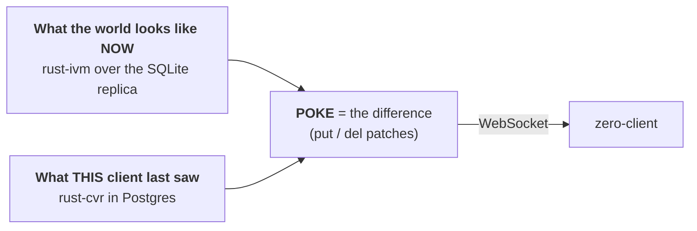
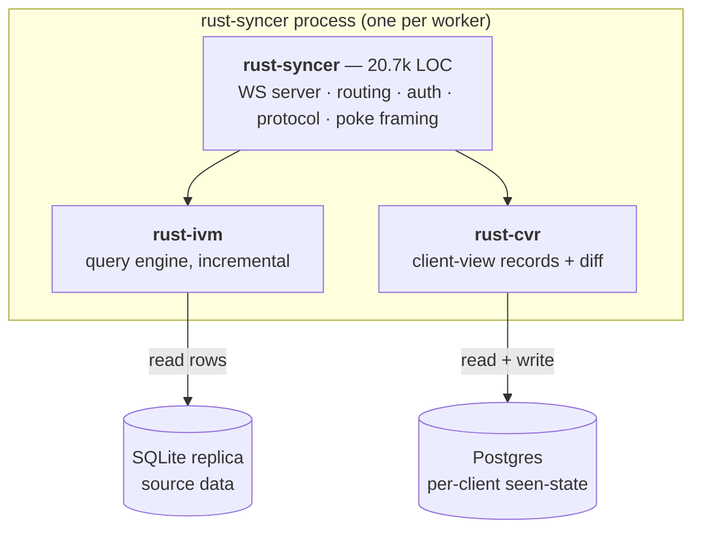
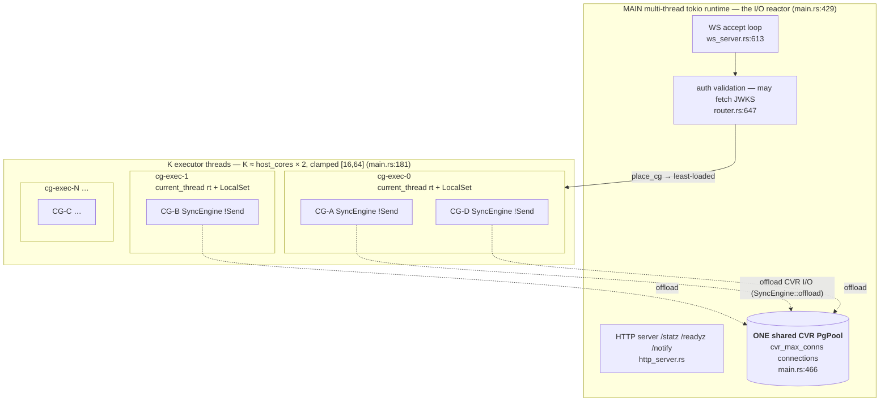
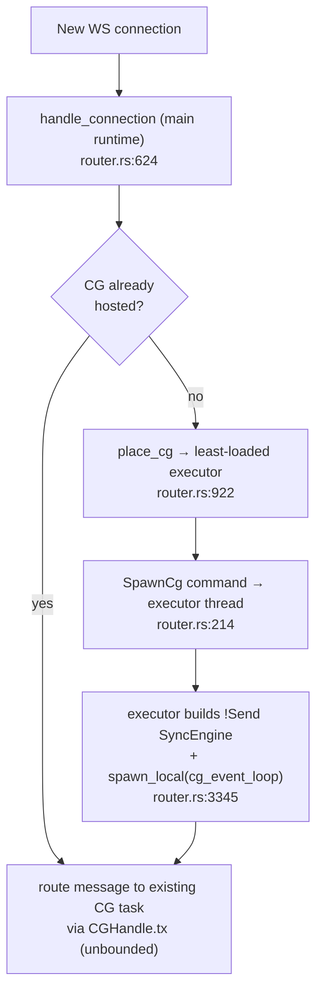
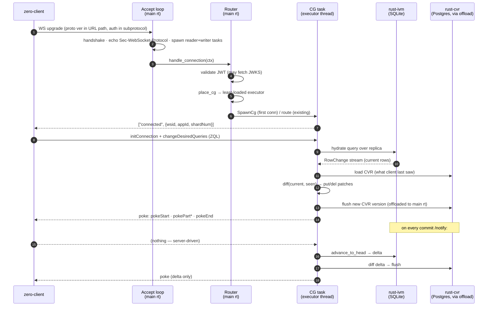
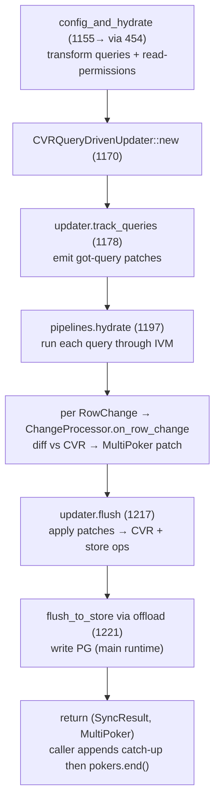
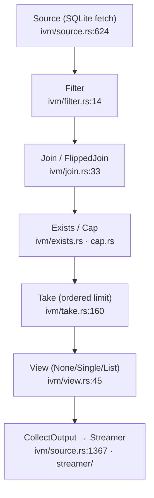
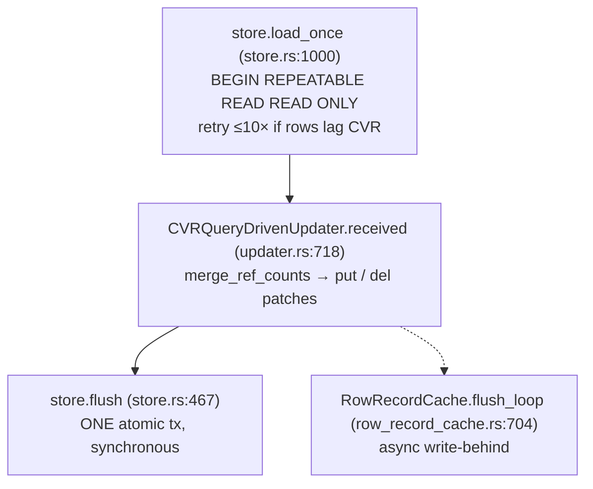
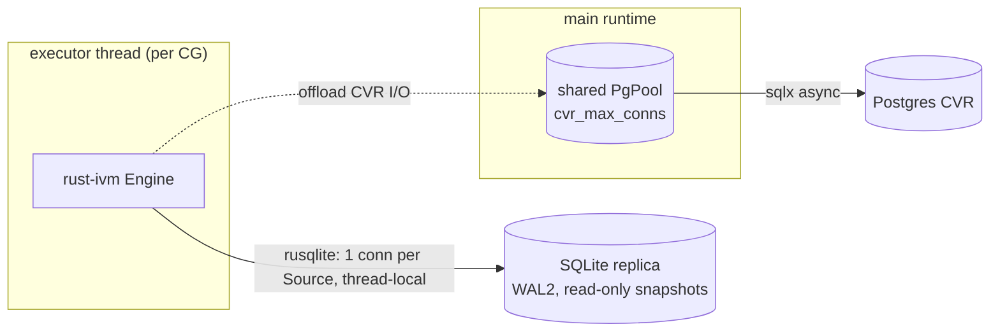

# Rust Syncer — Architecture Guide

> **Branch:** `rust-cvr-v1.0.0`
> **Audience:** engineers onboarding onto the Rust port of Zero's sync engine.
> **Scope:** the read path — connect → subscribe to queries → receive reactive updates ("pokes"). Mutations are **not** processed here (they are relayed to TS; see [§11](#11-what-this-does-not-do)).
>
> Every claim below was checked against the actual code, not just doc-comments. File/line references use `file:line` and are clickable in most editors. Line numbers drift as code changes — treat them as "look near here."
>
> **Companion deep-dives:**
> - [`RUST-SYNCER-DEEP-DIVE.md`](./RUST-SYNCER-DEEP-DIVE.md) — the `rust-syncer` crate itself: connection lifecycle, protocol, message dispatch, poke egress, stage by stage.
> - [`RUST-CVR-DEEP-DIVE.md`](./RUST-CVR-DEEP-DIVE.md) — the Client View Record: what it is, versions, refCounts, patches, updaters, persistence — the "what should the poke contain" half.
> - [`RUST-SYNCER-DB-AND-OFFLOAD.md`](./RUST-SYNCER-DB-AND-OFFLOAD.md) — the two databases, the shared PG pool, and the `offload` model in full detail (expands §3 + §10).
> - [`RUST-SYNCER-TS-PARITY.md`](./RUST-SYNCER-TS-PARITY.md) — behavior-level TS↔Rust parity: exact matches, intentional divergences, and release-gated differences (expands §15).
> - [`RUST-SYNCER-VS-HYPERSWITCH.md`](./RUST-SYNCER-VS-HYPERSWITCH.md) — library/stack comparison against Juspay's Hyperswitch (a mature production Rust codebase), and what's worth borrowing.

---

## Table of contents

1. [Mental model (read this first)](#1-mental-model-read-this-first)
2. [The three crates](#2-the-three-crates)
3. [Process & thread topology — the two-runtime model](#3-process--thread-topology--the-two-runtime-model)
4. [CG ↔ OS-thread mapping (the crux)](#4-cg--os-thread-mapping-the-crux)
5. [End-to-end request lifecycle](#5-end-to-end-request-lifecycle)
6. [The WebSocket layer](#6-the-websocket-layer)
7. [The SyncEngine hot path — hydrate / advance / diff / poke](#7-the-syncengine-hot-path--hydrate--advance--diff--poke)
8. [rust-ivm — the incremental view maintenance engine](#8-rust-ivm--the-incremental-view-maintenance-engine)
9. [rust-cvr — the client view record](#9-rust-cvr--the-client-view-record)
10. [Database connections — two DBs, two drivers](#10-database-connections--two-dbs-two-drivers)
11. [What this does *not* do](#11-what-this-does-not-do)
12. [Parallelism model — summary](#12-parallelism-model--summary)
13. [Libraries](#13-libraries)
14. [Profiler & memory](#14-profiler--memory)
15. [TS ↔ Rust module map](#15-ts--rust-module-map)
16. [Invariants & gotchas](#16-invariants--gotchas)

---

## 1. Mental model (read this first)

Zero is a **reactive sync engine**. A browser opens a WebSocket, subscribes to a set of ZQL queries, and the server pushes incremental diffs whenever the underlying data changes. There are three pieces of state, and the whole engine is a function over them:



> **The one sentence to remember:** *IVM tells you the current result of a query; the CVR tells you what the client already has; the difference is the poke.*

Two operations drive everything:

- **Hydrate** — a client subscribes to a new query. Run it through IVM, diff the full result against the CVR, poke the difference.
- **Advance** — new data committed to the replica. Incrementally push the change through the IVM graph, diff the delta against the CVR, poke it.

---

## 2. The three crates



| Crate | Role | DB | Driver | Send? |
|---|---|---|---|---|
| **rust-syncer** | Front door: WebSocket, auth, connection routing, protocol, poke framing | — | `tokio-tungstenite`, `axum` | mixed |
| **rust-ivm** | Runs ZQL queries incrementally over the SQLite replica | SQLite (read) | `rusqlite` | **!Send** |
| **rust-cvr** | Tracks what each client has seen; computes diffs; persists to PG | Postgres (read+write) | `sqlx` | Send (async) |

`rust-syncer` depends on both; `rust-ivm` and `rust-cvr` do not depend on each other — the syncer's `SyncEngine` stitches them together (`packages/rust-syncer/src/sync_engine.rs`).

---

## 3. Process & thread topology — the two-runtime model

This is the most important diagram in the document. The process runs **two kinds of threads on purpose**:



**Why two runtimes?** Two hard constraints collide:

1. The IVM engine is **single-threaded by nature** — it is built on `Rc<RefCell<…>>` and thread-local `rusqlite` connections, so a `SyncEngine` is `!Send` and can never move between threads. Parallelism therefore comes from *spreading client groups across threads*.
2. The CVR Postgres connections must be a **single shared pool** (to match TS's one-pool-per-worker budget and let any connection serve any group).

The resolution ("doc 91, Iteration C"):

- **K executor threads** are the compute lanes. Each is a `tokio` **`current_thread` runtime + `LocalSet`** (`router.rs:3204-3209`), hosting a hash/least-loaded shard of client groups as `spawn_local` tasks.
- **The main multi-thread runtime** owns the reactor (accept loop, HTTP, JWKS fetches) **and the one shared PG pool**.
- When a CG needs Postgres I/O, it does **not** run it on its executor thread. It **offloads** the future onto the main runtime via `SyncEngine::offload` (`sync_engine.rs:152`), so the pool's connections are always polled by the reactor that created them.

```rust
// sync_engine.rs:152 — the offload primitive
async fn offload<F, T>(&self, fut: F) -> T
where F: Future<Output = T> + Send + 'static, T: Send + 'static,
{
    match &self.tokio_handle {
        Some(handle) => handle.spawn(fut).await.unwrap_or_else(|e| panic!(...)),
        None => fut.await, // no handle (unit tests) → run inline
    }
}
```

> **Takeaway:** executor threads = CPU-bound IVM/diff work; main runtime = all socket & DB I/O. The `!Send` engine never leaves its thread; only `Send` I/O futures cross over to the pool.

---

## 4. CG ↔ OS-thread mapping (the crux)

A **client group (CG)** is one browser app instance's set of clients+queries. Here is exactly how it maps onto a thread:



The rules, each grounded in code:

1. **A CG is pinned to exactly one executor thread for its whole life.** The `SyncEngine` is `!Send`; migrating it would force a full IVM rehydrate, which is rejected by design (`router.rs:902-905`). Placement is chosen **once**.

2. **Placement is least-loaded** (`place_cg`, `router.rs:922`): count live groups per executor, pick the emptiest, break ties by hashing `cg_id`. Because placement is serialized under `cg_creation_lock` and the new group is inserted before the lock releases, it degenerates to **round-robin** — per-executor group counts stay within 1 of each other (`router.rs:907-913`).

3. **Many CGs share one OS thread cooperatively.** The CG's event loop is a `spawn_local` future on the executor's `LocalSet` (`router.rs:3345`). There is **no per-CG OS thread** and no per-CG `JoinHandle` — the router keeps only a lightweight `CGHandle` (a channel + two atomics, `router.rs:171-183`). Draining is done by shutting the executors down.

4. **The executor count is tuned for tail latency, not throughput.** This is the single richest comment in the repo (`main.rs:157-188`). Each executor **serializes** its client groups: a 12k-row hydrate + poke serialization holds the thread ~200ms, and any CG sharing that thread eats that latency. Measured A/B (ART G25, 4-CPU container):

   | Shards | Result |
   |---|---|
   | 4 (= cores) | 41+/51 queries breach 2× TS parity, p95 → multi-second |
   | 14 (~2 CGs/shard) | 10–17 violations, p95 → 1.6s |
   | 28 (1 CG/shard) | **0 violations** |
   | 56 | slight regression (burstier egress) |

   Sweet spot: **2× host cores**, clamped `[16, 64]`.

5. **`host_parallelism()`, not `available_parallelism()`** (`main.rs:215-229`). `std::thread::available_parallelism` is cgroup-quota-aware and returns `4` inside a `--cpus 4` container — which would silently recreate the quota-sized pool the design exists to avoid. The code reads the **CPU affinity mask** (`sched_getaffinity`, quota-independent, `nproc` semantics) instead, and only *warns* on a 3×+ quota/host mismatch (`warn_if_quota_capped`, `main.rs:236`).

### The CG event loop

Once spawned, each CG runs `cg_event_loop` (`router.rs:3345`), a `tokio::select!` (biased) over the message channel plus three deadline timers:


Notifications are **coalesced** — the loop drains consecutive `Notification`s with `try_recv()` and merges them into a single advance, keeping the oldest commit time (TS notifier pattern, `router.rs:3500-3514`).

---

## 5. End-to-end request lifecycle



**Hop-by-hop with code anchors:**

| # | What | Where |
|---|---|---|
| WS accept | handshake, echo subprotocol, 10MB cap, spawn reader+writer | `ws_server.rs:112-335` |
| Route + auth | auth **before** touching existing conns (anti-DoS) | `router.rs:624`, `:641-647` |
| Placement/spawn | least-loaded → SpawnCg → build engine + `spawn_local` | `router.rs:922`, `:214`, `:3345` |
| `connected` frame | `["connected",{wsid,timestamp,appId,shardNum}]` | `connection.rs:124`, `protocol.rs:727` |
| Hydrate → diff → poke | `config_and_hydrate` → `hydrate_and_sync` | `sync_engine.rs:454`, `:1155` |
| Advance | `advance_and_sync` on commit notification | `sync_engine.rs:1255` |

---

## 6. The WebSocket layer

`ws_server.rs` ports `workers/syncer.ts` + `workers/connection.ts`, using `tokio-tungstenite`. Each accepted socket becomes **two tokio tasks on the main runtime**:


Key design points:

- **Reader** (`:478`) forwards client text to a **bounded** `mpsc` channel (capacity 256, `:282`) and stamps liveness on *every* frame (incl. ping/pong).
- **Writer** (`:338`) drains an **unbounded** downstream channel (`:288`) — unbounded **deliberately**, to preserve poke frame order (`pokeStart → pokePart* → pokeEnd`). Memory is bounded not by the channel but by the slow-client shed policy.
- **Slow-client shed** — two high-water marks trip a `watch` kill signal that closes the socket ahead of its backlog:
  - frame HWM = 4096 (`ZERO_WS_DOWNSTREAM_HWM`, `:40`)
  - byte HWM = 256MB estimated-serialized (`ZERO_WS_DOWNSTREAM_BYTE_HWM`, `:49`)
- **Liveness** — a client that sends nothing for 60s (12 missed 5s pings) is closed rather than buffering pokes against a half-open socket (`:56`, `:421-440`).
- **Backpressure accounting is symmetric** — `DirectWebSocketSink.send_command` adds `est_bytes` at enqueue (`ws_sink.rs:153`); the writer subtracts the exact same value at dequeue (`ws_server.rs:379`), so gauges can't drift.
- **Subprotocol echo** (`:148-160`) — the client ships its `initConnection`/auth as a `Sec-WebSocket-Protocol` value; per RFC 6455 the server *must* select one back or the client aborts.
- **Payload cap** enforced at the tungstenite layer (`:164-168`), so an oversized message is rejected before it reaches any channel.

---

## 7. The SyncEngine hot path — hydrate / advance / diff / poke

`SyncEngine` (`sync_engine.rs:67`) is the `!Send` object that owns one CG's world:

```rust
pub struct SyncEngine {
    pipelines: IvmPipelines,                              // rust-ivm engine + sources  (!Send: Rc<RefCell>)
    store: Option<Arc<tokio::sync::Mutex<CVRStoreHandle>>>, // rust-cvr Postgres handle
    row_cache: Option<RowRecordCache>,                    // cached persisted CVR rows
    clients: HashMap<String, Arc<ClientHandler>>,         // poke sinks by client
    tokio_handle: Option<tokio::runtime::Handle>,         // for offload()
    enable_query_covering: bool,
    _census: live_count::Guard,                           // leak census (see §14)
}
```

### Hydrate path — `hydrate_and_sync` (`sync_engine.rs:1155`)



- `pipelines.hydrate` (`pipeline_driver.rs:398`) calls the IVM engine's streaming add-queries, invoking a callback per row. Panic-safe: it checkpoints source connections and rolls back on panic.
- The diff is `CVRQueryDrivenUpdater.received` (`updater.rs:718`): for each row it calls `merge_ref_counts` (`cvr.rs:27`) — if all refs drop to zero the row is a **del**, otherwise a **put** with a version compare to avoid a needless version bump.
- The poke is **not** ended inside `hydrate_and_sync`; the caller appends catch-up patches (rows missed while the client was away) and then calls `pokers.end()`.

### Advance path — `advance_and_sync` (`sync_engine.rs:1255`)

Runs on each commit notification:

1. `pipelines.advance` (`pipeline_driver.rs:457`) streams the replica delta tail→head, returning `AdvanceOutcome::Advanced{version, num_changes}` or `AdvanceOutcome::Reset{reason}` (scalar-subquery / schema change → caller rehydrates).
2. Build a `CVRQueryDrivenUpdater` at the **actual post-advance version from the engine header** (`:1321` — using the empty string here used to be a bug).
3. Diff each collected `RowChange`, `updater.flush()`, then `flush_to_store()` via `offload`.
4. `pokers.end(version)` — **only clients at the pre-advance version are poked**; lagging clients are excluded (`advance_poke_targets`, `:920`).

### Row-set signatures (drift detection)

Each row contributes an XOR-folded unit hash of `(table, row_key)` per query (`accumulate_signature`, `sync_engine.rs:1607`; edits skipped). The folded signature is persisted in the CVR and compared on each advance to detect divergence between IVM's view and the CVR.

---

## 8. rust-ivm — the incremental view maintenance engine

A faithful port of the TS ZQL IVM engine: TS `Iterable<T>` → Rust `Iterator`, TS operators → Rust operators implementing `Input`/`Output` traits. **Single-threaded actor model.**

### The Engine

`Engine` (`engine/mod.rs:344`) owns:

- `sources: HashMap<String, Shared<dyn Source>>` — one per table (`Shared<T> = Rc<RefCell<T>>`, `ivm/operator.rs:76`)
- `pipelines: Vec<PipelineEntry>` — the registered query graphs
- `primary_keys` / `client_primary_keys` / `unique_keys` / `table_specs`
- `row_set_signatures: HashMap<String, u64>`
- `cancellation_token` — cooperative abort

**Why `!Send`:** `Rc` (non-atomic refcount) + `RefCell` interior mutability + `rusqlite::Connection` (thread-local). This is the root reason the whole CG is thread-pinned.

**The Drop that stops a leak** (`engine/mod.rs:1418`):

```rust
impl Drop for Engine {
    fn drop(&mut self) { self.destroy(); } // walks pipelines, breaks Rc back-edges
}
```

Operators form **strong `Rc` cycles** (each op holds its input down-edge, and `set_output` installs an output back-edge). Without `destroy()`, every CG teardown would leak the entire operator tree **and** its pinned SQLite connections — this was the **G6 RSS leak**.

### The operator graph



| Operator | File | Role |
|---|---|---|
| `Source` | `ivm/source.rs:624` | root; reads SQLite via `fetch(FetchRequest)` |
| `Filter` | `ivm/filter.rs:14` | stateless predicate |
| `Take` | `ivm/take.rs:160` | ordered limit (has comparator) |
| `Cap` | `ivm/cap.rs:88` | unordered limit for EXISTS |
| `Join` / `FlippedJoin` | `ivm/join.rs:33` · `flipped_join.rs:62` | parent↔child correlation |
| `Exists` | `ivm/exists.rs:32` | relationship existence filter |
| `Skip` | `ivm/skip.rs:18` | pagination |
| `FanIn`/`FanOut`/`Union*` | `ivm/fan_in.rs` … | stream merge/split |
| `View` | `ivm/view.rs:45` | client-facing shape |

**Traits** (`ivm/operator.rs`): `Input` (`fetch` + `set_output`), `Output` (`push(change)`), `Storage` (`get/set/del/scan` for Take/Cap state). **Change model** (`ivm/change.rs:33`): `Add | Remove | Edit | Child`.

### Build & advance

- **Build:** `build_pipeline(ast, delegate)` (`builder/builder.rs:56`) walks the ZQL AST → source connect → WHERE Filter → correlated subqueries (Cap/Exists) → related Joins → Skip/Take. The **planner** (`planner/builder.rs:52`) informs join order via a SQLite cost model; it does not generate code.
- **Advance:** `advance_to_head_stream` (`engine/mod.rs:852`) asks the **Snapshotter** for the diff between the previous and current replica snapshots, sets sources to the PREV snapshot for fetch consistency, then pushes each `SourceChange` through the graph via `push_source_change` (`:1477`), streaming `RowChange`s out.

### Reading the replica

- **One `rusqlite` connection per Source** (`ivm/source.rs:695-698`) — matches TS's one-`better-sqlite3`-Database-per-source.
- The **Snapshotter** (`snapshotter/snapshotter.rs:35`) manages leapfrogging `BEGIN CONCURRENT` snapshots over a WAL2 replica, deriving diffs from the append-only `_zero.changeLog2`. It is `Send` (can move to a worker) but not `Sync`.

---

## 9. rust-cvr — the client view record

The **CVR** is the Postgres-backed record of what each client group has seen.

```rust
// types.rs:200
pub struct CVR {
    pub id: String,                          // == client group id
    pub version: CVRVersion,
    pub clients:  BTreeMap<String, ClientRecord>,
    pub queries:  BTreeMap<String, QueryRecord>,
    pub replica_version: Option<String>,
    // … last_active, ttl_clock, client_schema, profile_id
}
// version.rs:23
pub struct CVRVersion {
    pub state_version: String,        // base36 major version: "00","01",…  (bumped on advance)
    pub config_version: Option<u64>,  // bumped on config changes (client/query adds)
}
```

The version serializes to a cookie/watermark like `"01"` or `"01:01"` and is what the client echoes back on reconnect.

### Load / diff / write



- **Load** (`store.rs:1000`) — a single read-only `REPEATABLE READ` transaction pulling instance + clients + queries + desires, with a `LEFT JOIN rowsVersion` check and up to 10 retries if the row data lags the CVR head.
- **Diff** (`updater.rs:718`) — `received(rows, existing_rows)` compares new rows against the CVR's `refCounts` via `merge_ref_counts` (`cvr.rs:27`): refs→zero means **del**, otherwise **put** (reusing the existing patch version if the row is unchanged).
- **Write** (`store.rs:467`) — the CVR store flush is **one synchronous atomic transaction**: instance upsert, clients insert/delete, query upserts/partial updates, desire upserts, `rowsVersion` bump, and row-record deletes+inserts. Batched writes use `json_to_recordset()` (one statement instead of N).

> **Sync vs write-behind — read this carefully.** The store flush *logic* is a synchronous transaction (it awaits `COMMIT`). But from the CG thread's perspective it is **offloaded onto the main runtime** via `SyncEngine::offload` (§3), so it does not block the serving thread's CPU. Separately, **row records** have their own **async write-behind** flush loop (`row_record_cache.rs:704`, `flush_one_iteration:777`) that batches inserts via `json_to_recordset` but still issues **per-row DELETEs** (not batched — a known inefficiency that matches TS). Historically a *synchronous inline* CVR write on the serving thread caused hydrate stalls; the offload + write-behind split is the fix.

### Row keys

`RowID = {schema, table, row_key}` (`row_key.rs:44`); the canonical string form is a JSON array `["schema","table",k1,v1,…]` with keys in lexicographic order (`row_key.rs:84`), streamed straight to bytes with no intermediate `Value`. The row is keyed by the **client primary key**.

---

## 10. Database connections — two DBs, two drivers



| | SQLite replica | Postgres CVR |
|---|---|---|
| **Purpose** | source data (the "world") | per-client seen-state |
| **Access** | read-only, snapshot-isolated | read + write |
| **Driver** | `rusqlite` (sync, thread-local) | `sqlx` (async, pooled) |
| **Connection model** | one connection **per IVM Source**, pinned to the CG thread | **one shared pool** for the whole process (`main.rs:466`) |
| **Who polls it** | the executor thread directly | the main runtime, via `offload` |
| **Concurrency unit** | one snapshot per advance (Snapshotter leapfrog) | `pool.begin()` per transaction |

The pool is created eagerly but falls back to a **lazy** pool if the CVR PG is unreachable at boot — deliberate TS parity (TS also comes up "ready" with CVR down and connects lazily). `/readyz` reports the true health for the load balancer (`main.rs:472-491`).

> **Full detail** on pool config, retries/timeouts, the `offload` call sites, CVR load/flush transactions, the row-record write-behind loop, and the Snapshotter's leapfrog connections lives in [`RUST-SYNCER-DB-AND-OFFLOAD.md`](./RUST-SYNCER-DB-AND-OFFLOAD.md).

---

## 11. What this does *not* do

- **No mutation processing.** `create_mutagen` returns `None` (`main.rs:715`); legacy CRUD is rejected.
- **Custom mutations are relayed, not run.** With `PUSHER_URL` set, a custom push is forwarded (with the connection's auth/headers) to the TS push endpoint via `push_relay.rs`; the result flows back through the `lmids`/`mutationResults` queries this syncer already hydrates and pokes. No mutation logic lives here.
- **No handoff model.** Unlike TS, the WS server accepts directly (`ws_server.rs:5`).

---

## 12. Parallelism model — summary

| Concern | Mechanism | Where |
|---|---|---|
| Accept + I/O reactor | main multi-thread `tokio` runtime | `main.rs:429` |
| Per-CG compute | K `current_thread` executors + `LocalSet` | `router.rs:3204` |
| CG placement | least-loaded, pinned for life | `router.rs:922` |
| CG isolation unit | `spawn_local` task per CG | `router.rs:3345` |
| Cross-thread routing | `mpsc::UnboundedSender` in `CGHandle` | `router.rs:174` |
| Connection map | `DashMap` (lock-free shards) | `router.rs:395` |
| Shared state locks | `parking_lot::Mutex`, `Arc<AtomicU64/Bool>` | throughout |
| DB I/O offload | `SyncEngine::offload` → main runtime | `sync_engine.rs:152` |
| Backpressure | atomic depth/byte counters + `watch` kill | `ws_sink.rs:153` |

**The core idea:** IVM can't be parallelized *within* a group (it's `!Send`), so throughput comes from *spreading groups across executor threads*, while all blocking I/O is kept off those threads.

---

## 13. Libraries

| Crate | Used for |
|---|---|
| `tokio` (full) | async runtimes (main multi-thread + per-executor current_thread) |
| `tokio-tungstenite` 0.24 | WebSocket protocol |
| `axum` 0.7 | HTTP endpoints (`/statz`, `/readyz`, `/metrics`, `/notify`) |
| `sqlx` 0.8 (postgres) | async CVR Postgres access |
| `rusqlite` 0.32 | SQLite replica reads |
| `dashmap` 6 | lock-free `cg_id → CGHandle` map |
| `parking_lot` 0.12 | fast mutexes in the IVM engine & router |
| `rustc-hash` (`FxHashMap`) | fast non-crypto hashing on hot paths |
| `xxhash-rust` (xxh32) | row/content hashing in CVR |
| `serde` / `serde_json` (`preserve_order`, `rc`) | protocol + JSON, order-preserving for stable output |
| `jsonwebtoken` 9 | JWT/JWKS auth validation |
| `reqwest` 0.12 (rustls) | JWKS fetch + push relay |
| `opentelemetry` + `opentelemetry-otlp` 0.32 | OTLP metrics push (same collector as TS) |
| `dhat` 0.3 (optional) | heap profiler (feature `dhat-heap`) |
| `libc` | `sched_getaffinity`, `malloc_trim` (Linux/glibc) |
| `thiserror` / `async-trait` / `futures-util` | ergonomics |

---

## 14. Profiler & memory

Three memory-related mechanisms, all in `main.rs`:

1. **dhat heap profiler** (`main.rs:342-382`) — build with `--features dhat-heap`; a global allocator intercepts every allocation. On **graceful** shutdown it writes `dhat-heap.json` (path via `ZERO_DHAT_OUT`, defaults next to the replica file). View at the dh_view web UI. A SIGKILL skips the dump — always drain gracefully.
2. **`malloc_trim` task** (`main.rs:581-594`) — a dedicated thread calls `libc::malloc_trim(0)` every 30s (Linux/glibc only). Freed pipeline/row memory otherwise stays in malloc's arenas and reads as an unbounded RSS leak (the ART **G6** gate). Kept well off the hot path.
3. **Live-instance census** (`live_count.rs`) — each long-lived type increments a counter on construction and decrements on `Drop`. Used to prove the G6 leak was fixed: at `cg=0` the census returns to 0 and RSS plateaus. Every `SyncEngine`/`Engine` carries a `_census: Guard`.

---

## 15. TS ↔ Rust module map

Every Rust module cites its TS origin in a doc-comment (HARD RULE 6). The
**authoritative** file→file mapping is machine-generated by
`parity/parity_ledger.py` (content-derived, so renames still bind) into
`parity/MAP-cvr.md`, `parity/MAP-ivm.md`, `parity/MAP-syncer.md` — regenerate
those, don't hand-edit. The tables below are the human-readable snapshot
(each TS file → its **primary** Rust file; genuine splits show all real
targets). Updated 2026-08-31 after the L9 1:1 refactor (tasks #159–#163). For
*behavior-level* parity see `parity/PARITY-EXCEPTIONS.md` (sanctioned deltas)
and `parity/INVENTIONS.md` (rust-only constructs).

Counts: **cvr 8 / 8 clean 1:1 · ivm ~62 · syncer 24** TS source files ported.

### rust-cvr (← `packages/zero-cache/src/services/view-syncer/…` → `packages/rust-cvr/src/…`)

| TS file | Rust file |
|---|---|
| `client-handler.ts` | `client_handler.rs` |
| `cvr-store.ts` | `cvr_store.rs` |
| `cvr.ts` | `cvr.rs` |
| `row-record-cache.ts` | `row_record_cache.rs` |
| `row-set-signature.ts` | `row_set_signature.rs` |
| `ttl-clock.ts` | `ttl_clock.rs` |
| `schema/cvr.ts` | `schema/cvr.rs` |
| `schema/types.ts` | `schema/types.rs` |

Rust-only (no TS twin): `change_processor.rs` (the `#processChanges` row-batch
loop, extracted), `hash.rs`, `row_key.rs`, `shards.rs`, `tracer.rs`,
`live_count.rs`, `otel_metrics.rs`, `seq_replay.rs`, `parity_check.rs`.

### rust-ivm (← `packages/zql/src/…` → `packages/rust-ivm/src/…`)

| TS file | Rust file |
|---|---|
| `builder/builder.ts` | `builder/builder.rs` |
| `builder/filter.ts` | `builder/filter.rs` |
| `builder/like.ts` | `builder/like.rs` |
| `ivm/array-view.ts` | `ivm/array_view.rs` |
| `ivm/cap.ts` | `ivm/cap.rs` |
| `ivm/catch.ts` | `ivm/catch.rs` |
| `ivm/change.ts` (+ `change-type*.ts`, `change-index-enum.ts`) | `ivm/change.rs` |
| `ivm/constraint.ts` | `ivm/constraint.rs` |
| `ivm/data.ts` (+ `source-change-index*.ts`) | `ivm/data.rs` |
| `ivm/exists.ts` | `ivm/exists.rs` |
| `ivm/fan-in.ts` | `ivm/fan_in.rs` |
| `ivm/fan-out.ts` | `ivm/fan_out.rs` |
| `ivm/filter-operators.ts` | `ivm/filter_operators.rs` |
| `ivm/filter.ts` | `ivm/filter.rs` |
| `ivm/filter-push.ts` (+ `maybe-split-and-push-edit-change.ts`) | `ivm/filter_push.rs` |
| `ivm/flipped-join.ts` | `ivm/flipped_join.rs` |
| `ivm/join.ts` | `ivm/join.rs` |
| `ivm/join-utils.ts` | `ivm/join_utils.rs` |
| `ivm/memory-source.ts` **(split)** | `ivm/source.rs` + `sqlite/table_source.rs` |
| `ivm/memory-storage.ts` | `ivm/memory_storage.rs` |
| `ivm/operator.ts` | `ivm/operator.rs` |
| `ivm/push-accumulated.ts` | `ivm/push_accumulated.rs` |
| `ivm/schema.ts` | `ivm/schema.rs` |
| `ivm/skip.ts` | `ivm/skip.rs` |
| `ivm/skip-yields.ts` | `ivm/stream.rs` |
| `ivm/snitch.ts` | `ivm/snitch.rs` |
| `ivm/source.ts` | `ivm/source.rs` |
| `ivm/stopable-iterator.ts` | `ivm/stopable_iterator.rs` |
| `ivm/stream.ts` | `ivm/stream.rs` + `streamer/mod.rs` |
| `ivm/take.ts` | `ivm/take.rs` |
| `ivm/union-fan-in.ts` | `ivm/union_fan_in.rs` |
| `ivm/union-fan-out.ts` | `ivm/union_fan_out.rs` |
| `ivm/view-apply-change.ts` **(split)** | `ivm/view.rs` + `ivm/array_view.rs` |
| `ivm/view.ts` | `ivm/view.rs` |
| `planner/planner-builder.ts` | `planner/planner_builder.rs` |
| `planner/planner-connection.ts` | `planner/planner_connection.rs` |
| `planner/planner-constraint.ts` | `planner/planner_constraint.rs` |
| `planner/planner-fan-in.ts` | `planner/planner_fan_in.rs` |
| `planner/planner-fan-out.ts` | `planner/planner_fan_out.rs` |
| `planner/planner-graph.ts` | `planner/planner_graph.rs` |
| `planner/planner-join.ts` | `planner/planner_join.rs` |
| `planner/planner-node.ts` | `planner/planner_node.rs` |
| `planner/planner-source.ts` | `planner/planner_source.rs` |
| `planner/planner-terminus.ts` | `planner/planner_terminus.rs` |
| `query/complete-ordering.ts` | `query/complete_ordering.rs` |
| `query/error.ts` | `query/error.rs` |
| `query/escape-like.ts` | `query/escape_like.rs` |
| `query/expression.ts` | `query/expression.rs` |
| `query/measure-push-operator.ts` | `query/measure_push_operator.rs` |
| `query/metrics-delegate.ts` | `query/metrics_delegate.rs` |
| `query/named.ts` | `query/named.rs` |
| `query/query-delegate-base.ts` | `query/query_delegate_base.rs` |
| `query/query-delegate.ts` | `query/query_delegate_base.rs` + `sqlite/query_delegate.rs` |
| `query/query-impl.ts` | `query/query_impl.rs` |
| `query/query-internals.ts` | `query/query_internals.rs` |
| `query/query-registry.ts` | `query/query_registry.rs` |
| `query/runnable-query-impl.ts` (+ `static-query.ts`) | `query/runnable_query_impl.rs` |
| `query/schema-query.ts` | `query/schema_query.rs` |
| `query/ttl.ts` | `query/ttl.rs` |
| `query/typed-view.ts` | `query/typed_view.rs` |
| `query/validate-input.ts` | `query/validate_input.rs` |

The `sqlite/` subtree is a 1:1 port of the **`zqlite` TS package**
(`packages/zqlite/src/…` → `packages/rust-ivm/src/sqlite/…`), the SQLite-backed
half of the engine — NOT rust-only inventions:

| TS file | Rust file |
|---|---|
| `zqlite/table-source.ts` | `sqlite/table_source.rs` |
| `zqlite/db.ts` | `sqlite/db.rs` |
| `zqlite/query-delegate.ts` | `sqlite/query_delegate.rs` |
| `zqlite/query-builder.ts` | `sqlite/query_builder.rs` |
| `zqlite/database-storage.ts` | `sqlite/database_storage.rs` |
| `zqlite/explain-queries.ts` | `sqlite/explain_queries.rs` |
| `zqlite/options.ts` | `sqlite/options.rs` |
| `zqlite/resolve-scalar-subqueries.ts` | `sqlite/resolve_scalar_subqueries.rs` |
| `zqlite/sqlite-cost-model.ts` | `sqlite/sqlite_cost_model.rs` |
| `zqlite/sqlite-stat-fanout.ts` | `sqlite/sqlite_stat_fanout.rs` |

Dropped (no port needed): `builder/like-test-cases.ts` (test data),
`ivm/change-index.ts`, `ivm/default-format.ts` (1–5 LOC type shims),
`zqlite/internal/*` (statement-cache/sql helpers folded into `db.rs`/query
building). Genuinely rust-only (no TS twin): `advance_gate.rs`, `perf_trace.rs`,
`otel_metrics.rs`, `snapshotter/*`, `sqlite/interrupt.rs` (SQLite progress-
handler cancellation watchdog).

### rust-syncer (← `packages/zero-cache/src/…` → `packages/rust-syncer/src/…`)

| TS file | Rust file |
|---|---|
| `auth/auth.ts` | `services/view_syncer/connection_context_manager.rs` |
| `auth/jwt.ts` | `auth/jwt.rs` |
| `auth/load-permissions.ts` | `auth/load_permissions.rs` |
| `auth/read-authorizer.ts` | `auth/read_authorizer.rs` |
| `config/zero-config.ts` | `config/zero_config.rs` |
| `custom-queries/transform-query.ts` | `custom_queries/transform_query.rs` |
| `custom/fetch.ts` **(split)** | `custom/fetch.rs` + `custom/metrics.rs` |
| `custom/metrics.ts` | `custom/metrics.rs` |
| `db/lite-tables.ts` | `db/lite_tables.rs` |
| `observability/metrics.ts` | `observability/metrics.rs` |
| `server/otel-start.ts` | `server/otel_start.rs` |
| `server/syncer.ts` | `server/syncer.rs` |
| `services/mutagen/pusher.ts` | `services/mutagen/pusher.rs` |
| `services/view-syncer/connection-context-manager.ts` | `services/view_syncer/connection_context_manager.rs` |
| `services/view-syncer/drain-coordinator.ts` | `services/view_syncer/drain_coordinator.rs` |
| `services/view-syncer/e2e-serving-lag.ts` | `services/view_syncer/e2e_serving_lag.rs` |
| `services/view-syncer/inspect-handler.ts` | `services/view_syncer/inspect_handler.rs` |
| `services/view-syncer/pipeline-driver.ts` | `services/view_syncer/pipeline_driver.rs` |
| `services/view-syncer/query-covering.ts` | `services/view_syncer/query_covering.rs` |
| `services/view-syncer/view-syncer.ts` | `services/view_syncer/view_syncer.rs` |
| `workers/connect-params.ts` | `workers/connect_params.rs` |
| `workers/connection.ts` | `workers/connection.rs` |
| `workers/syncer-ws-message-handler.ts` | `workers/syncer_ws_message_handler.rs` |
| `workers/syncer.ts` | `workers/syncer.rs` |

Rust-only inventions (no TS twin): `main.rs`, `http_server.rs`, `ws_server.rs`,
`ws_sink.rs`, `workers/cg_executor.rs`, the Option-A push-relay drainer inside
`services/mutagen/pusher.rs` (loopback endpoint is TS-side
`zero-cache/src/server/rust-push-relay.ts`), and the whole `protocol/` serde
tree (mirrors the `zero-protocol` TS package, outside the syncer's port remit).

---

## 16. Invariants & gotchas

1. **`!Send` engine ⇒ pinned CG.** A `SyncEngine`/`Engine` never crosses threads. Anything that would require migration (rebalancing a hot group) is out of scope — balance by placement only.
2. **Poke ordering is load-bearing.** The downstream channel is unbounded specifically to keep `pokeStart → pokePart* → pokeEnd` in order. Do not "fix" it into a bounded channel; use the shed HWMs for memory safety instead.
3. **`Engine` must be `destroy()`ed on teardown** or the `Rc` operator cycle leaks the graph + SQLite connections (G6). The `Drop` impl handles it — don't bypass it by leaking the `Engine`.
4. **Row keys use the client PK.** A CVR rowKey missing a PK column poisons the shared PG and can crash-loop clients (`toPrimaryKeyString "Got undefined"`) — and survives a TS image revert. Assert rowKey completeness at write time.
5. **Only current-version clients get advance pokes.** Lagging clients are excluded and must catch up via rehydrate.
6. **`available_parallelism()` is quota-aware — don't use it for shard sizing.** Use the affinity mask (`host_parallelism`).
7. **Shards trade tail latency, not throughput.** More executors = more CG isolation (good) but burstier per-socket egress past ~2× cores (diminishing). Default `2× host cores`, `[16,64]`.
8. **CVR store flush is a synchronous transaction but offloaded** off the serving thread; row records are async write-behind. Keep new CVR I/O on the offload path, never inline on the CG thread.

---

*Generated from a code-level read of `packages/rust-syncer`, `packages/rust-ivm`, and `packages/rust-cvr` on branch `rust-cvr-v1.0.0`. Diagrams are Mermaid — they render in GitHub, VS Code, and claude.ai. Line numbers are approximate anchors; grep the named function if one has moved.*
