# Rust Syncer — Architecture Guide

> **Branch:** `rust-cvr-v1.0.0`
> **Audience:** engineers onboarding onto the Rust port of Zero's sync engine.
> **Scope:** the read path — connect → subscribe to queries → receive reactive updates ("pokes"). Mutations are **not** processed here (they are relayed to TS; see [§11](#11-what-this-does-not-do)).
>
> Every claim below was re-checked against the actual code on `rust-cvr-v1.0.0` (post the **L9 1:1 structural refactor**, tasks #159–#163, which dissolved the old `sync_engine.rs`/`router.rs` into the TS-mirrored `services/view_syncer/` + `workers/` tree). File/line references use `file:line` and are clickable in most editors. Line numbers drift as code changes — treat them as "look near here"; grep the named function if one has moved.
>
> **Living companions (parity/ layer system — the source of truth for TS↔Rust status):**
> - [`parity/INVENTIONS.md`](./parity/INVENTIONS.md) — every rust-only construct (thread model, ws tasks, push relay, CVR write-behind, per-CG inspector, advance gate) with its TS-observable contract + pinning tests (I-1 … I-11).
> - [`parity/PARITY-EXCEPTIONS.md`](./parity/PARITY-EXCEPTIONS.md) — sanctioned TS↔Rust deltas with justification.
> - [`parity/ZERO-DIVERGENCE-PLAN.md`](./parity/ZERO-DIVERGENCE-PLAN.md) — the divergence-hunting layer system (L1–L8) + status ledger.
> - [`parity/MAP-syncer.md`](./parity/MAP-syncer.md) / `MAP-ivm.md` / `MAP-cvr.md` — machine-generated, authoritative TS-file→Rust-file map (regenerate; don't hand-edit).
> - [`packages/rust-syncer/OPERATIONS.md`](./packages/rust-syncer/OPERATIONS.md) — prod runbook (rollback, drain, profiling, sharp edges).
>
> **Archived deep-dives** (frozen snapshots per `DOCS.md`; pre-L9, so file names inside are stale — read for concepts, not paths): `RUST-SYNCER-DEEP-DIVE.md`, `RUST-CVR-DEEP-DIVE.md`, `RUST-SYNCER-DB-AND-OFFLOAD.md`, `RUST-SYNCER-TS-PARITY.md`, `RUST-SYNCER-VS-HYPERSWITCH.md`.

---

## Table of contents

1. [Mental model (read this first)](#1-mental-model-read-this-first)
2. [The three crates](#2-the-three-crates)
3. [Process & thread topology — the two-runtime model](#3-process--thread-topology--the-two-runtime-model)
4. [CG ↔ OS-thread mapping (the crux)](#4-cg--os-thread-mapping-the-crux)
5. [End-to-end request lifecycle](#5-end-to-end-request-lifecycle)
6. [The WebSocket layer](#6-the-websocket-layer)
7. [The ViewSyncerService hot path — hydrate / advance / diff / poke](#7-the-viewsyncerservice-hot-path--hydrate--advance--diff--poke)
8. [rust-ivm — the incremental view maintenance engine](#8-rust-ivm--the-incremental-view-maintenance-engine)
9. [rust-cvr — the client view record](#9-rust-cvr--the-client-view-record)
10. [Database connections — two DBs, two drivers](#10-database-connections--two-dbs-two-drivers)
11. [What this does *not* do](#11-what-this-does-not-do)
12. [Parallelism model — summary](#12-parallelism-model--summary)
13. [Libraries](#13-libraries)
14. [Profiler & memory](#14-profiler--memory)
15. [TS ↔ Rust module map](#15-ts--rust-module-map)
16. [The inspector / analyzeQuery surface](#16-the-inspector--analyzequery-surface)
17. [Invariants & gotchas](#17-invariants--gotchas)

---

## 1. Mental model (read this first)

Zero is a **reactive sync engine**. A browser opens a WebSocket, subscribes to a set of ZQL queries, and the server pushes incremental diffs whenever the underlying data changes. There are three pieces of state, and the whole engine is a function over them:

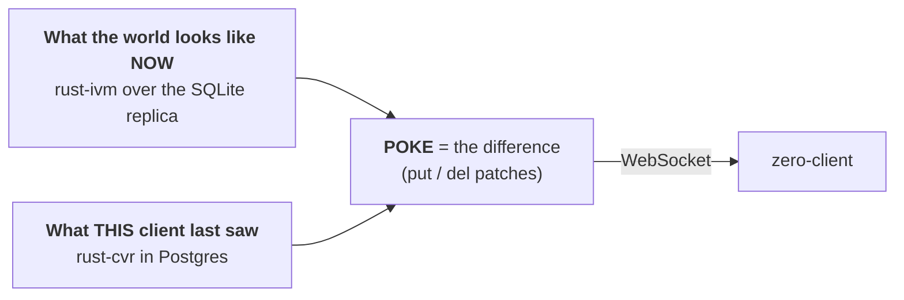

> **The one sentence to remember:** *IVM tells you the current result of a query; the CVR tells you what the client already has; the difference is the poke.*

Two operations drive everything:

- **Hydrate** — a client subscribes to a new query. Run it through IVM, diff the full result against the CVR, poke the difference.
- **Advance** — new data committed to the replica. Incrementally push the change through the IVM graph, diff the delta against the CVR, poke it.

---

## 2. The three crates

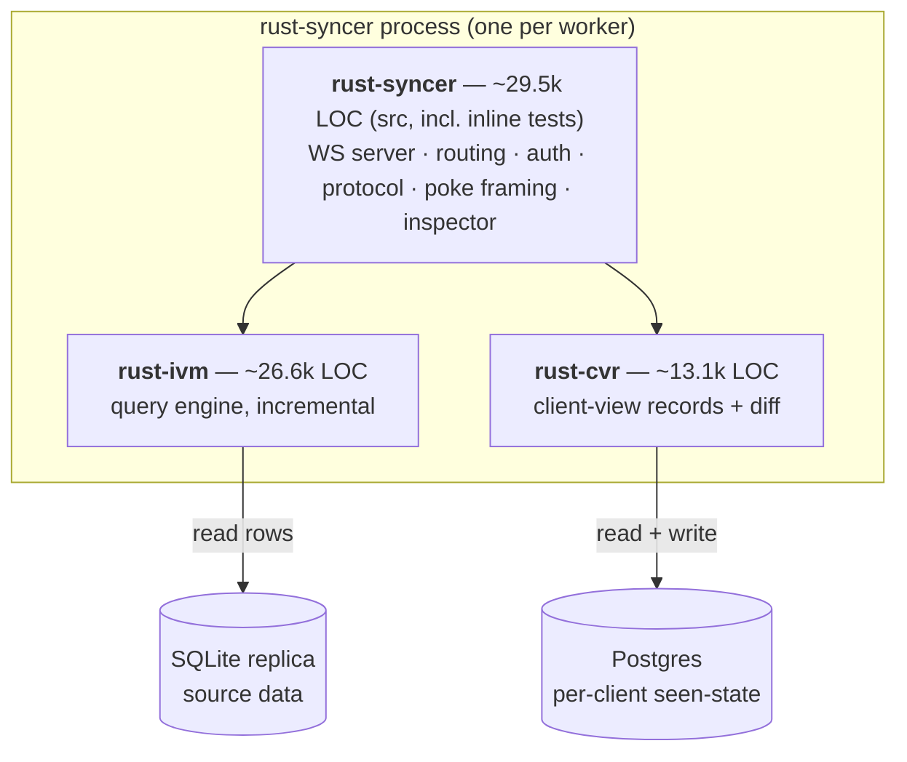

| Crate | Role | DB | Driver | Send? |
|---|---|---|---|---|
| **rust-syncer** | Front door: WebSocket, auth, connection routing, protocol, poke framing, inspector | — | `tokio-tungstenite`, `axum` | mixed |
| **rust-ivm** | Runs ZQL queries incrementally over the SQLite replica | SQLite (read) | `rusqlite` | **!Send** |
| **rust-cvr** | Tracks what each client has seen; computes diffs; persists to PG | Postgres (read+write) | `sqlx` | Send (async) |

`rust-syncer` depends on both; `rust-ivm` and `rust-cvr` do not depend on each other — the syncer's **`ViewSyncerService`** stitches them together (`packages/rust-syncer/src/services/view_syncer/view_syncer.rs:629`). (This struct was called `SyncEngine` in `sync_engine.rs` before the L9 refactor; the old file is gone. The name `SyncEngineConfig` survives as the config struct, `view_syncer.rs:195`.)

---

## 3. Process & thread topology — the two-runtime model

This is the most important diagram in the document. The process runs **two kinds of threads on purpose**:

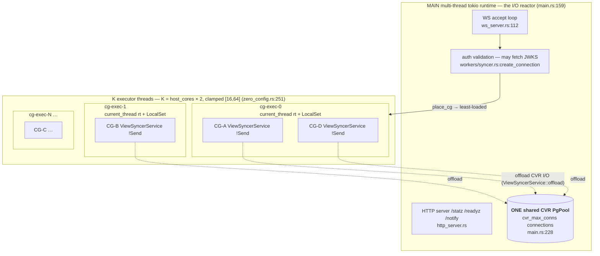

**Why two runtimes?** Two hard constraints collide:

1. The IVM engine is **single-threaded by nature** — it is built on `Rc<RefCell<…>>` and thread-local `rusqlite` connections, so a `ViewSyncerService` is `!Send` and can never move between threads. Parallelism therefore comes from *spreading client groups across threads*.
2. The CVR Postgres connections must be a **single shared pool** (to match TS's one-pool-per-worker budget and let any connection serve any group).

The resolution ("doc 91, Iteration C"):

- **K executor threads** are the compute lanes. Each is a `tokio` **`current_thread` runtime + `LocalSet`** (`workers/cg_executor.rs:204-208`), hosting a hash/least-loaded shard of client groups as `spawn_local` tasks.
- **The main multi-thread runtime** owns the reactor (accept loop, HTTP, JWKS fetches) **and the one shared PG pool**.
- When a CG needs Postgres I/O, it does **not** run it on its executor thread. It **offloads** the future onto the main runtime via `ViewSyncerService::offload` (`view_syncer.rs:6618`), so the pool's connections are always polled by the reactor that created them.

```rust
// view_syncer.rs:6618 — the offload primitive
async fn offload<F, T>(&self, fut: F) -> T
where F: Future<Output = T> + Send + 'static, T: Send + 'static,
{
    match &self.tokio_handle {
        Some(handle) => match handle.spawn(fut).await {
            Ok(v) => v,
            Err(e) => { tracing::error!("offloaded CVR I/O task failed: {e}"); panic!(...) }
        },
        None => fut.await, // no handle (unit tests) → run inline
    }
}
```

> **Takeaway:** executor threads = CPU-bound IVM/diff work; main runtime = all socket & DB I/O. The `!Send` engine never leaves its thread; only `Send` I/O futures cross over to the pool.

---

## 4. CG ↔ OS-thread mapping (the crux)

A **client group (CG)** is one browser app instance's set of clients+queries. Here is exactly how it maps onto a thread:

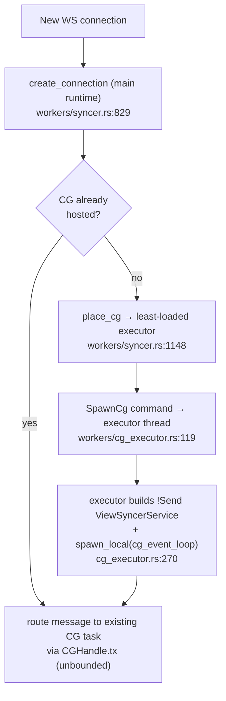

The rules, each grounded in code:

1. **A CG is pinned to exactly one executor thread for its whole life.** The `ViewSyncerService` is `!Send`; migrating it would force a full IVM rehydrate, which is rejected by design. Placement is chosen **once**.

2. **Placement is least-loaded** (`place_cg`, `workers/syncer.rs:1148`): count live groups per executor, pick the emptiest, break ties by hashing `cg_id`. Because placement is serialized under `cg_creation_lock` (`workers/syncer.rs:579`, taken at `:1024`) and the new group is inserted before the lock releases, it degenerates to **round-robin** — per-executor group counts stay within 1 of each other (`workers/syncer.rs:1134`).

3. **Many CGs share one OS thread cooperatively.** The CG's event loop is a `spawn_local` future on the executor's `LocalSet` (`cg_executor.rs:270`). There is **no per-CG OS thread** and no per-CG `JoinHandle` — the router keeps only a lightweight `CGHandle` (a channel + shared counters, `cg_executor.rs:72-143`), stored in a `DashMap<String, CGHandle>` (`workers/syncer.rs:576`). Draining is done by shutting the executors down.

4. **The executor count is tuned for tail latency, not throughput.** This is the single richest comment in the repo (`main.rs:157-212`; the default is computed in `config/zero_config.rs:245-252`). Each executor **serializes** its client groups: a 12k-row hydrate + poke serialization holds the thread ~200ms, and any CG sharing that thread eats that latency. Measured A/B (ART G25, 4-CPU container):

   | Shards | Result |
   |---|---|
   | 4 (= cores) | 41+/51 queries breach 2× TS parity, p95 → multi-second |
   | 14 (~2 CGs/shard) | 10–17 violations, p95 → 1.6s |
   | 28 (1 CG/shard) | **0 violations** |
   | 56 | slight regression (burstier egress) |

   Sweet spot: **2× host cores**, clamped `[16, 64]` (`(host_parallelism() * 2).clamp(16, 64)`, `config/zero_config.rs:251`; override with `ZERO_SYNCER_SHARDS`).

5. **`host_parallelism()`, not `available_parallelism()`** (`config/zero_config.rs:19-31`). `std::thread::available_parallelism` is cgroup-quota-aware and returns `4` inside a `--cpus 4` container — which would silently recreate the quota-sized pool the design exists to avoid. The code reads the **CPU affinity mask** (`sched_getaffinity`, quota-independent, `nproc` semantics, `zero_config.rs:23`) instead, and only *warns* on a 3×+ quota/host mismatch (`warn_if_quota_capped`, `config/zero_config.rs:40`).

### The CG event loop

Once spawned, each CG runs `cg_event_loop` (`view_syncer.rs:2922`, invoked from `cg_executor.rs:278`), a `tokio::select!` (**biased**, `view_syncer.rs:3029-3030`) over the message channel plus deadline timers:

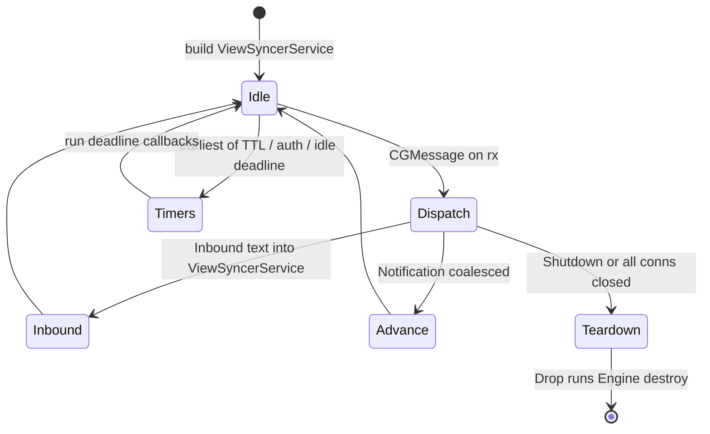

Notifications are **coalesced** — the `Notification` arm drains consecutive `Notification`s with `try_recv()` and merges them into a single advance, newest state winning but keeping the oldest commit time (TS `notifier.ts` pattern, `view_syncer.rs:3114-3174`).

---

## 5. End-to-end request lifecycle

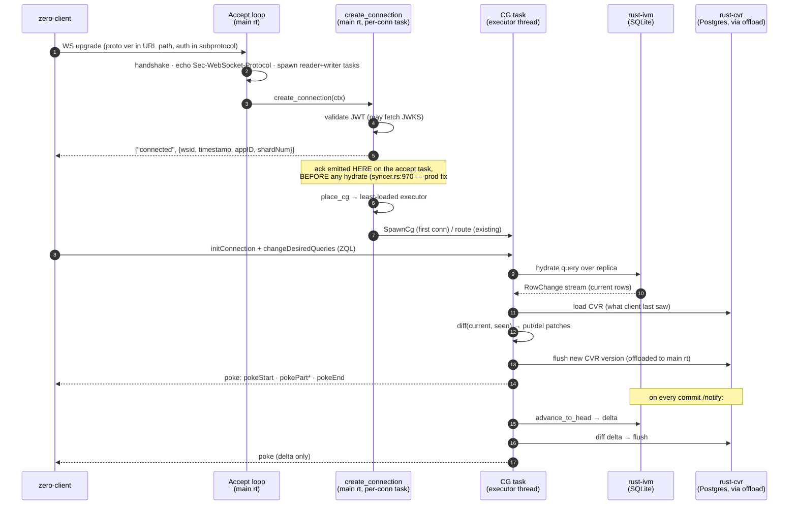

> **⚠ The `connected` ack is NOT on the CG thread.** It is emitted from `create_connection` (`workers/syncer.rs:829`, the port of TS `syncer.ts#handleConnection`) on the **per-connection accept task, before any hydrate** (emit at `workers/syncer.rs:956-970`; body built by `check_version`, `workers/connection.rs:608`). This is the fix for the **2026-08-27 prod outage** (task #152): the old code sent `connected` from `Connection::init()` *inside* the serial CG thread, so a slow hydrate (79–254s prod queries) blocked the ack past the client's 10s connect timeout → disconnect → IVM-graph reap → cold-rehydrate thrash. TS sends the ack from the per-connection worker (concurrent), and now so does Rust. The L3 `call_topology.py` guard pins this emission to the accept-task context.

**Hop-by-hop with code anchors:**

| # | What | Where |
|---|---|---|
| WS accept | handshake, echo subprotocol, 10MB cap, spawn reader+writer | `ws_server.rs:112`, `:119`, `:302-341` |
| Route + auth | auth **before** touching existing conns (anti-DoS) | `workers/syncer.rs:829` (`create_connection`) |
| `connected` frame | `["connected",{wsid,timestamp,appID,shardNum}]` on the accept task | `workers/syncer.rs:970`, `protocol/connect.rs:52` |
| Placement/spawn | least-loaded → SpawnCg → build engine + `spawn_local` | `workers/syncer.rs:1148`, `cg_executor.rs:119`, `:270` |
| Hydrate → diff → poke | `config_and_hydrate` → `hydrate_and_sync` | `view_syncer.rs:6940`, `:7883` |
| Advance | `advance_and_sync` on commit notification | `view_syncer.rs:8074` |

---

## 6. The WebSocket layer

`ws_server.rs` ports `workers/syncer.ts` + `workers/connection.ts`, using `tokio-tungstenite`. Each accepted socket becomes **two tokio tasks on the main runtime**:

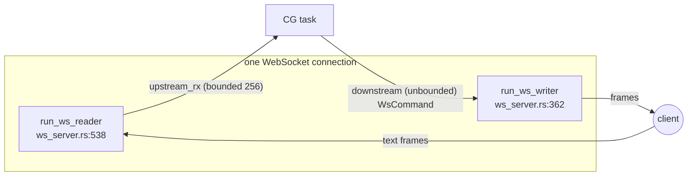

Key design points:

- **Reader** (`:538`) forwards client text to a **bounded** `mpsc` channel (capacity 256, `:302`) and stamps liveness on *every* frame (incl. ping/pong).
- **Writer** (`:362`) drains an **unbounded** downstream channel (`:308`) — unbounded **deliberately**, to preserve poke frame order (`pokeStart → pokePart* → pokeEnd`). Memory is bounded not by the channel but by the slow-client shed policy.
- **Slow-client shed** — two high-water marks trip a `watch` kill signal that closes the socket ahead of its backlog:
  - frame HWM = 4096 (`ZERO_WS_DOWNSTREAM_HWM`, `:39`, `:59`)
  - byte HWM = 256MB estimated-serialized (`ZERO_WS_DOWNSTREAM_BYTE_HWM`, `:49`, `:69`; `0` disables byte shedding — rollout escape hatch)
- **Liveness** — a client that sends nothing for 60s (12 missed 5s pings) is closed rather than buffering pokes against a half-open socket (`:51-76`, writer check at `:455-460`).
- **Backpressure accounting is symmetric** — `DirectWebSocketSink` adds `est_bytes` (and +1 depth) at enqueue (`ws_sink.rs:158`, `:173`); the writer subtracts the exact same values at dequeue (`ws_server.rs:399`, `ws_sink.rs:374`), so the gauges can't drift.
- **Subprotocol echo** — the client ships its `initConnection`/auth as a `Sec-WebSocket-Protocol` value; per RFC 6455 the server *must* select one back or the client aborts.
- **Payload cap** enforced at the tungstenite layer (`DEFAULT_MAX_PAYLOAD_BYTES = 10 * 1024 * 1024`, `:32`; applied at `:175`), so an oversized message is rejected before it reaches any channel.

---

## 7. The ViewSyncerService hot path — hydrate / advance / diff / poke

`ViewSyncerService` (`view_syncer.rs:629`) is the `!Send` object that owns one CG's world. Representative fields (the struct grew in the L9 refactor to absorb what were once free functions on the router):

```rust
pub struct ViewSyncerService {
    cg_id: String,
    pipelines: IvmPipelines,                                 // rust-ivm engine + sources (!Send: Rc<RefCell>)
    store: Option<Arc<tokio::sync::Mutex<CVRStoreHandle>>>,  // rust-cvr Postgres handle
    row_cache: Option<RowRecordCache>,                       // cached persisted CVR rows
    clients: HashMap<String, Arc<ClientHandler>>,            // poke sinks by client
    tokio_handle: Option<tokio::runtime::Handle>,            // for offload()
    self_handle: Option<Weak<RefCell<ViewSyncerService>>>,   // Rust-only: re-entrancy without an Rc cycle
    ccm: Arc<Mutex<ConnectionContextManager>>,               // single owner of connection/auth state (I-8)
    mutagen: Option<Arc<dyn MutagenDispatch>>,               // push relay (Option-A)
    pusher: Option<Arc<dyn PusherDispatch>>,
    inspector_delegate: RefCell<InspectorDelegate>,          // per-CG metrics + queryID→AST (§16, I-10)
    permissions: Option<serde_json::Value>,                  // read-authorizer rules (read at use time)
    shard: ShardID, replica_version: String, app_id: String,
    enable_query_covering: bool,
    _engine_census: live_count::Guard,                       // leak census (see §14)
    // … ttl/auth deadlines, replica_path, permissions_hash, etc.
}
```

### Hydrate path — `hydrate_and_sync` (`view_syncer.rs:7883`)

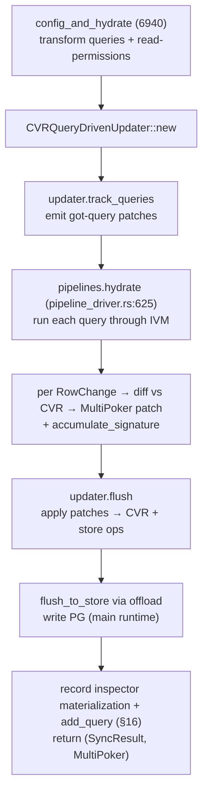

- `pipelines.hydrate` (`pipeline_driver.rs:625`) calls the IVM engine's streaming add-queries, invoking a callback per row. Panic-safe: it checkpoints source connections and rolls back on panic.
- The diff is `CVRQueryDrivenUpdater::received` (`cvr.rs:1034`): for each row it calls `merge_ref_counts` (`cvr.rs:40`) — if all refs drop to zero the row is a **del**, otherwise a **put** with a version compare to avoid a needless version bump.
- The poke is **not** ended inside `hydrate_and_sync`; the caller appends catch-up patches (rows missed while the client was away) and then calls `pokers.end()`.
- After the hydrate loop, per query it records `add_metric(QueryMaterializationServer, ms, qid)` + `add_query(qid, ast)` into the per-CG `InspectorDelegate` (mirrors TS `#addQueryMaterializationServerMetric` at view-syncer.ts:2296; see §16).

### Advance path — `advance_and_sync` (`view_syncer.rs:8074`)

Runs on each commit notification:

1. `pipelines.advance` (`pipeline_driver.rs:793`) streams the replica delta tail→head, returning `AdvanceOutcome::Advanced{version, num_changes}` or `AdvanceOutcome::Reset{reason}` (scalar-subquery / schema change → caller rehydrates).
2. Build a `CVRQueryDrivenUpdater` at the **actual post-advance version from the engine header** (using the empty string here used to be a bug).
3. Diff each collected `RowChange`, `updater.flush()`, then `flush_to_store()` via `offload`.
4. `pokers.end(version)` — **only clients at the pre-advance version are poked**; lagging clients are excluded (`advance_poke_targets`, `view_syncer.rs:7542`).

### `hydrateUnchangedQueries` (`view_syncer.rs:7778`)

A same-transformation-hash re-hydrate path (TS `#hydrateUnchangedQueries`): re-materializes queries whose transformation hash is unchanged, records the inspector metric keyed by `transformationHash` (mirrors view-syncer.ts:1640), and feeds `accumulate_signature`.

### Row-set signatures (drift detection)

Each row contributes an XOR-folded unit hash of `(table, row_key)` per query (`accumulate_signature`, called from both hydrate paths; edits skipped). The folded signature is persisted in the CVR and compared on each advance to detect divergence between IVM's view and the CVR.

---

## 8. rust-ivm — the incremental view maintenance engine

A faithful port of the TS ZQL IVM engine: TS `Iterable<T>` → Rust `Iterator`, TS operators → Rust operators implementing `Input`/`Output` traits. **Single-threaded actor model.**

### The Engine

`Engine` (`engine/mod.rs:397`) owns:

- `sources: HashMap<String, Shared<dyn Source>>` — one per table (`Shared<T> = Rc<RefCell<T>>`)
- `pipelines: Vec<PipelineEntry>` — the registered query graphs
- `primary_keys` / `client_primary_keys` / `unique_keys` / `table_specs`
- `row_set_signatures: HashMap<String, u64>`
- `cancellation_token` — cooperative abort

**Why `!Send`:** `Rc` (non-atomic refcount) + `RefCell` interior mutability + `rusqlite::Connection` (thread-local). This is the root reason the whole CG is thread-pinned.

**The Drop that stops a leak** (`engine/mod.rs:1717`, calling `destroy()` at `:1689`):

```rust
impl Drop for Engine {
    fn drop(&mut self) { self.destroy(); } // walks pipelines, breaks Rc back-edges
}
```

Operators form **strong `Rc` cycles** (each op holds its input down-edge, and `set_output` installs an output back-edge). Without `destroy()`, every CG teardown would leak the entire operator tree **and** its pinned SQLite connections — this was the **G6 RSS leak**.

### The operator graph

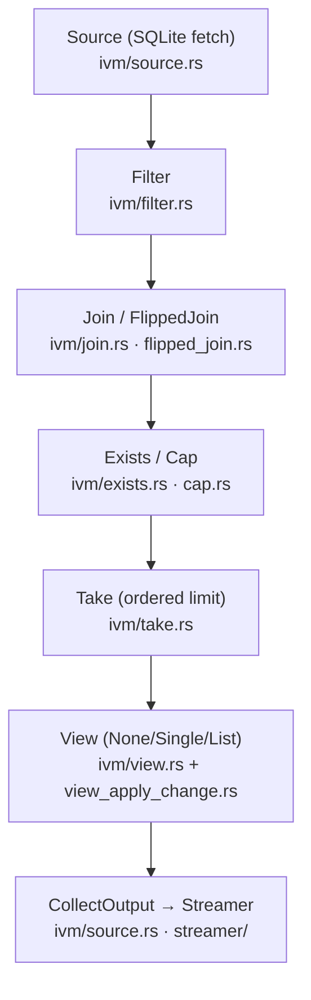

| Operator | File | Role |
|---|---|---|
| `Source` | `ivm/source.rs` | root; reads SQLite via `fetch(FetchRequest)` |
| `Filter` | `ivm/filter.rs` | stateless predicate |
| `Take` | `ivm/take.rs` | ordered limit (has comparator) |
| `Cap` | `ivm/cap.rs` | unordered limit for EXISTS |
| `Join` / `FlippedJoin` | `ivm/join.rs` · `flipped_join.rs` | parent↔child correlation |
| `Exists` | `ivm/exists.rs` | relationship existence filter |
| `Skip` | `ivm/skip.rs` | pagination |
| `FanIn`/`FanOut`/`Union*` | `ivm/fan_in.rs` … | stream merge/split |
| `View` | `ivm/view.rs` (+ `view_apply_change.rs`) | client-facing shape |

**Traits** (`ivm/operator.rs`): `Input` (`fetch` + `set_output`), `Output` (`push(change)`), `Storage` (`get/set/del/scan` for Take/Cap state). **Change model** (`ivm/change.rs`): `Add | Remove | Edit | Child`.

### Build & advance

- **Build:** `build_pipeline(ast, delegate)` (`builder/builder.rs`) walks the ZQL AST → source connect → WHERE Filter → correlated subqueries (Cap/Exists) → related Joins → Skip/Take. The **planner** (`planner/planner_builder.rs`) informs join order via a SQLite cost model; it does not generate code. The `plan_query` flip-planner is wired into engine build (fix for the G8 exists-in-OR over-emission, tasks #165).
- **Advance:** `advance_to_head_stream` (`engine/mod.rs:1153`) asks the **Snapshotter** for the diff between the previous and current replica snapshots, sets sources to the PREV snapshot for fetch consistency, then pushes each `SourceChange` through the graph, streaming `RowChange`s out.

### Reading the replica

- **One `rusqlite` connection per Source** — matches TS's one-`better-sqlite3`-Database-per-source.
- The **Snapshotter** (`snapshotter/snapshotter.rs`, a 1:1 port of `zero-cache/src/services/view-syncer/snapshotter.ts`) manages leapfrogging `BEGIN CONCURRENT` snapshots over a WAL2 replica, deriving diffs from the append-only `_zero.changeLog2` (`snapshotter/diff.rs` ← TS `Diff`). It is `Send` (can move to a worker) but not `Sync`.

---

## 9. rust-cvr — the client view record

The **CVR** is the Postgres-backed record of what each client group has seen.

```rust
// cvr.rs:1344
pub struct CVR {
    pub id: String,                          // == client group id
    pub version: CVRVersion,
    pub clients:  BTreeMap<String, ClientRecord>,
    pub queries:  BTreeMap<String, QueryRecord>,
    pub replica_version: Option<String>,
    // … last_active, ttl_clock, client_schema, profile_id
}
// schema/types.rs:30
pub struct CVRVersion {
    pub state_version: String,        // base36 major version: "00","01",…  (bumped on advance)
    pub config_version: Option<u64>,  // bumped on config changes (client/query adds)
}
```

The version serializes to a cookie/watermark like `"01"` or `"01:01"` and is what the client echoes back on reconnect.

### Load / diff / write

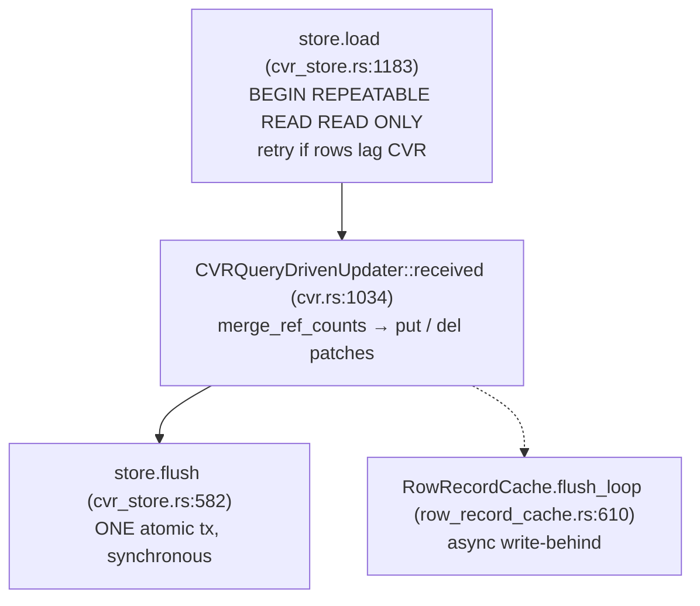

- **Load** (`cvr_store.rs:1183`) — a single read-only `REPEATABLE READ` transaction pulling instance + clients + queries + desires, with a `rowsVersion` check and retries if the row data lags the CVR head.
- **Diff** (`cvr.rs:1034`) — `CVRQueryDrivenUpdater::received(rows, existing_rows)` compares new rows against the CVR's `refCounts` via `merge_ref_counts` (`cvr.rs:40`): refs→zero means **del**, otherwise **put** (reusing the existing patch version if the row is unchanged). The three updater classes live in `cvr.rs` (there is no separate `updater.rs`), matching TS `cvr.ts`.
- **Write** (`cvr_store.rs:582`) — the CVR store flush is **one synchronous atomic transaction**: instance upsert, clients insert/delete, query upserts/partial updates, desire upserts, `rowsVersion` bump, and row-record deletes+inserts. Batched writes use `json_to_recordset()` (one statement instead of N; clients batch at `cvr_store.rs:789`).

> **Sync vs write-behind — read this carefully.** The store flush *logic* is a synchronous transaction (it awaits `COMMIT`). But from the CG thread's perspective it is **offloaded onto the main runtime** via `ViewSyncerService::offload` (§3), so it does not block the serving thread's CPU. Separately, **row records** have their own **async write-behind** flush loop (`row_record_cache.rs:610`, `flush_one_iteration:683`) that bulk-inserts via `json_to_recordset` (`:773`) but still issues **per-row DELETEs** (not batched — a known inefficiency that matches TS). Historically a *synchronous inline* CVR write on the serving thread caused hydrate stalls; the offload + write-behind split is the fix. Catch-up row streaming is bounded-memory: `CATCHUP_PAGE_SIZE = 10000` (`row_record_cache.rs:207`, matches TS `.cursor(10000)`).

### Row keys

`RowID = {schema, table, row_key}` (`row_key.rs`); the canonical string form is a JSON array `["schema","table",k1,v1,…]` with keys in lexicographic order (`row_id_string`, `row_key.rs:75`; cached variant `:155`), streamed straight to bytes with no intermediate `Value` (e.g. `["public","users","id",42]`, test at `row_key.rs:228`). The row is keyed by the **client primary key**.

---

## 10. Database connections — two DBs, two drivers

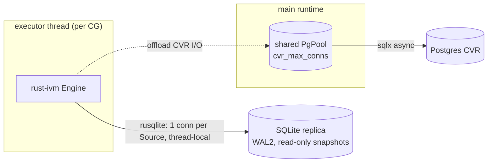

| | SQLite replica | Postgres CVR |
|---|---|---|
| **Purpose** | source data (the "world") | per-client seen-state |
| **Access** | read-only, snapshot-isolated | read + write |
| **Driver** | `rusqlite` (sync, thread-local) | `sqlx` (async, pooled) |
| **Connection model** | one connection **per IVM Source**, pinned to the CG thread | **one shared pool** for the whole process (`main.rs:228`) |
| **Who polls it** | the executor thread directly | the main runtime, via `offload` (`view_syncer.rs:6618`) |
| **Concurrency unit** | one snapshot per advance (Snapshotter leapfrog) | `pool.begin()` per transaction |

The pool is created eagerly but falls back to a **lazy** pool if the CVR PG is unreachable at boot — deliberate TS parity (TS also comes up "ready" with CVR down and connects lazily). `/readyz` reports the true health for the load balancer.

---

## 11. What this does *not* do

- **No mutation processing.** `create_mutagen` returns `None`; legacy CRUD is rejected.
- **Custom mutations are relayed, not run.** With `PUSHER_URL` set, a custom push is forwarded (with the connection's auth/headers, read from the CCM at use time — the 2026-08-27 stale-JWT fix, task #153) to the TS push endpoint via `services/mutagen/pusher.rs`; the result flows back through the `lmids`/`mutationResults` queries this syncer already hydrates and pokes. No mutation logic lives here (Option-A; the loopback endpoint is TS-side `zero-cache/src/server/rust-push-relay.ts`).
- **No handoff model.** Unlike TS, the WS server accepts directly.

---

## 12. Parallelism model — summary

| Concern | Mechanism | Where |
|---|---|---|
| Accept + I/O reactor | main multi-thread `tokio` runtime | `main.rs:159` |
| Per-CG compute | K `current_thread` executors + `LocalSet` | `workers/cg_executor.rs:194-208` |
| CG placement | least-loaded, pinned for life | `workers/syncer.rs:1148` |
| CG isolation unit | `spawn_local` task per CG | `workers/cg_executor.rs:270` |
| Cross-thread routing | `mpsc::UnboundedSender` in `CGHandle` | `workers/cg_executor.rs:72` |
| Connection map | `DashMap` (lock-free shards) | `workers/syncer.rs:576` |
| Shared state locks | `parking_lot::Mutex`, `Arc<AtomicU64/Bool>` | throughout |
| DB I/O offload | `ViewSyncerService::offload` → main runtime | `view_syncer.rs:6618` |
| Backpressure | atomic depth/byte counters + `watch` kill | `ws_sink.rs:158`/`:173` |

**The core idea:** IVM can't be parallelized *within* a group (it's `!Send`), so throughput comes from *spreading groups across executor threads*, while all blocking I/O is kept off those threads.

---

## 13. Libraries

Versions below are the direct dependencies across the three crates (`Cargo.toml`).

| Crate | Version | Used for |
|---|---|---|
| `tokio` (full) | 1 | async runtimes (main multi-thread + per-executor current_thread) |
| `tokio-tungstenite` | 0.24 | WebSocket protocol |
| `axum` | 0.7 | HTTP endpoints (`/statz`, `/readyz`, `/metrics`, `/notify`) |
| `sqlx` (postgres) | 0.8 | async CVR Postgres access |
| `rusqlite` | 0.32 | SQLite replica reads |
| `dashmap` | 6 | lock-free `cg_id → CGHandle` map |
| `parking_lot` | 0.12 | fast mutexes in the IVM engine & CVR (ivm, cvr) |
| `rustc-hash` (`FxHashMap`) | 2 | fast non-crypto hashing on hot paths (ivm, cvr) |
| `xxhash-rust` (xxh32) | 0.8 | row/content hashing in CVR |
| `serde` / `serde_json` | 1 | protocol + JSON (`preserve_order`, `rc` — order-preserving for stable output) |
| `jsonwebtoken` | 9 | JWT/JWKS auth validation |
| `reqwest` (rustls) | 0.12 | JWKS fetch + push relay |
| `opentelemetry` + `opentelemetry-otlp` | 0.32 | OTLP metrics push (same collector as TS) |
| `dhat` (optional) | 0.3 | heap profiler (feature `dhat-heap`) |
| `libc` | 0.2 | `sched_getaffinity`, `malloc_trim` (Linux/glibc) |
| `thiserror` / `async-trait` / `futures-util` | 2 / 0.1 / 0.3 | ergonomics |

---

## 14. Profiler & memory

Three memory-related mechanisms, all in `main.rs`:

1. **dhat heap profiler** (`main.rs:72-143`) — build with `--features dhat-heap`; a global allocator (`main.rs:74`) intercepts every allocation. On **graceful** shutdown it writes `dhat-heap.json` (path via `ZERO_DHAT_OUT`, defaults next to the replica file / CWD). View at the dh_view web UI. A SIGKILL skips the dump — always drain gracefully.
2. **`malloc_trim` task** (`main.rs:367-381`) — a dedicated thread calls `libc::malloc_trim(0)` every 30s (Linux/glibc only). Freed pipeline/row memory otherwise stays in malloc's arenas and reads as an unbounded RSS leak (the ART **G6** gate). Kept well off the hot path.
3. **Live-instance census** (`live_count.rs`) — each long-lived type increments a counter on construction and decrements on `Drop`. Used to prove the G6 leak was fixed: at `cg=0` the census returns to 0 and RSS plateaus. Every `ViewSyncerService`/`Engine` carries a census `Guard`.

---

## 15. TS ↔ Rust module map

Every Rust module cites its TS origin in a doc-comment (HARD RULE 6). The
**authoritative** file→file mapping is machine-generated by
`parity/parity_ledger.py` (content-derived, so renames still bind) into
`parity/MAP-cvr.md`, `parity/MAP-ivm.md`, `parity/MAP-syncer.md` — regenerate
those, don't hand-edit. The tables below are the human-readable snapshot
(each TS file → its **primary** Rust file; genuine splits show all real
targets). Updated 2026-09-01 after the L9 1:1 refactor (tasks #159–#163) and the
analyzeQuery/inspector port (tasks #168–#181). For *behavior-level* parity see
`parity/PARITY-EXCEPTIONS.md` (sanctioned deltas) and `parity/INVENTIONS.md`
(rust-only constructs).

### rust-cvr (← `packages/zero-cache/src/…` (+ `shared`, `zql`) → `packages/rust-cvr/src/…`)

| TS file | Rust file |
|---|---|
| `services/view-syncer/client-handler.ts` | `client_handler.rs` |
| `services/view-syncer/cvr-store.ts` | `cvr_store.rs` |
| `services/view-syncer/cvr.ts` | `cvr.rs` (pure helpers + the three `CVR*Updater` classes) |
| `services/view-syncer/row-record-cache.ts` | `row_record_cache.rs` |
| `services/view-syncer/row-set-signature.ts` | `row_set_signature.rs` |
| `services/view-syncer/ttl-clock.ts` | `ttl_clock.rs` |
| `services/view-syncer/schema/cvr.ts` | `schema/cvr.rs` |
| `services/view-syncer/schema/types.ts` | `schema/types.rs` |
| `services/view-syncer/view-syncer.ts` `#processChanges` (2217-2300) | `change_processor.rs` (extracted row-batch loop) |
| `types/row-key.ts` | `row_key.rs` |
| `types/shards.ts` | `shards.rs` |
| `shared/src/hash.ts` | `hash.rs` |
| `zql/src/query/ttl.ts` | `ttl.rs` |

Genuinely rust-only (no TS twin): `live_count.rs`, `otel_metrics.rs`,
`seq_replay.rs` (+ `bin/cvr_seq_replay.rs`), `parity_check.rs`, `tracer.rs`.

### rust-ivm (← `packages/zql/src/…`, `packages/zqlite/src/…`, + a few siblings → `packages/rust-ivm/src/…`)

**`builder/`** (← `zql/src/builder/`):

| TS file | Rust file |
|---|---|
| `builder/builder.ts` | `builder/builder.rs` |
| `builder/filter.ts` | `builder/filter.rs` |
| `builder/like.ts` | `builder/like.rs` |
| `builder/debug-delegate.ts` | `builder/debug_delegate.rs` |
| `zero-protocol/src/ast.ts` | `builder/ast.rs` |

**`ivm/`** operators + core (← `zql/src/ivm/`):

| TS file | Rust file |
|---|---|
| `ivm/array-view.ts` | `ivm/array_view.rs` |
| `ivm/cap.ts` | `ivm/cap.rs` |
| `ivm/catch.ts` | `ivm/catch.rs` |
| `ivm/change.ts` (+ `change-type*.ts`, `change-index-enum.ts`) | `ivm/change.rs` |
| `ivm/constraint.ts` | `ivm/constraint.rs` |
| `ivm/data.ts` (+ `source-change-index*.ts`) | `ivm/data.rs` |
| `ivm/exists.ts` | `ivm/exists.rs` |
| `ivm/fan-in.ts` | `ivm/fan_in.rs` |
| `ivm/fan-out.ts` | `ivm/fan_out.rs` |
| `ivm/filter-operators.ts` | `ivm/filter_operators.rs` |
| `ivm/filter.ts` | `ivm/filter.rs` |
| `ivm/filter-push.ts` (+ `maybe-split-and-push-edit-change.ts`) | `ivm/filter_push.rs` |
| `ivm/flipped-join.ts` | `ivm/flipped_join.rs` |
| `ivm/join.ts` | `ivm/join.rs` |
| `ivm/join-utils.ts` | `ivm/join_utils.rs` |
| `ivm/memory-source.ts` | `ivm/memory_source.rs` |
| `ivm/memory-storage.ts` | `ivm/memory_storage.rs` |
| `ivm/operator.ts` | `ivm/operator.rs` |
| `ivm/push-accumulated.ts` | `ivm/push_accumulated.rs` |
| `ivm/schema.ts` | `ivm/schema.rs` |
| `ivm/skip.ts` | `ivm/skip.rs` |
| `ivm/skip-yields.ts` | `ivm/stream.rs` |
| `ivm/snitch.ts` | `ivm/snitch.rs` |
| `ivm/source.ts` | `ivm/source.rs` |
| `ivm/stopable-iterator.ts` | `ivm/stopable_iterator.rs` |
| `ivm/stream.ts` | `ivm/stream.rs` |
| `ivm/take.ts` | `ivm/take.rs` |
| `ivm/union-fan-in.ts` | `ivm/union_fan_in.rs` |
| `ivm/union-fan-out.ts` | `ivm/union_fan_out.rs` |
| `ivm/view.ts` (+ `default-format.ts`) | `ivm/view.rs` |
| `ivm/view-apply-change.ts` | `ivm/view_apply_change.rs` |

**`planner/`** (← `zql/src/planner/`):

| TS file | Rust file |
|---|---|
| `planner/planner-builder.ts` | `planner/planner_builder.rs` |
| `planner/planner-connection.ts` | `planner/planner_connection.rs` |
| `planner/planner-constraint.ts` | `planner/planner_constraint.rs` |
| `planner/planner-debug.ts` | `planner/planner_debug.rs` |
| `planner/planner-fan-in.ts` | `planner/planner_fan_in.rs` |
| `planner/planner-fan-out.ts` | `planner/planner_fan_out.rs` |
| `planner/planner-graph.ts` | `planner/planner_graph.rs` |
| `planner/planner-join.ts` | `planner/planner_join.rs` |
| `planner/planner-node.ts` | `planner/planner_node.rs` |
| `planner/planner-source.ts` | `planner/planner_source.rs` |
| `planner/planner-terminus.ts` | `planner/planner_terminus.rs` |
| `zqlite/sqlite-cost-model.ts` (`createSQLiteCostModel` runtime) | `planner/runtime.rs` |

**`query/`** (← `zql/src/query/`):

| TS file | Rust file |
|---|---|
| `query/complete-ordering.ts` | `query/complete_ordering.rs` |
| `query/error.ts` | `query/error.rs` |
| `query/escape-like.ts` | `query/escape_like.rs` |
| `query/expression.ts` | `query/expression.rs` |
| `query/measure-push-operator.ts` | `query/measure_push_operator.rs` |
| `query/metrics-delegate.ts` | `query/metrics_delegate.rs` |
| `query/named.ts` | `query/named.rs` |
| `query/query-delegate.ts` + `query-delegate-base.ts` | `query/query_delegate_base.rs` |
| `query/query-impl.ts` | `query/query_impl.rs` |
| `query/query-internals.ts` | `query/query_internals.rs` |
| `query/query-registry.ts` | `query/query_registry.rs` |
| `query/runnable-query-impl.ts` + `static-query.ts` | `query/runnable_query_impl.rs` |
| `query/schema-query.ts` | `query/schema_query.rs` |
| `query/ttl.ts` | `query/ttl.rs` |
| `query/typed-view.ts` | `query/typed_view.rs` |
| `query/validate-input.ts` | `query/validate_input.rs` |

**`engine/`, `streamer/`, `snapshotter/`** — note `pipeline-driver.ts` and
`snapshotter.ts` live in `zero-cache` but are engine-side and ported here:

| TS file | Rust file |
|---|---|
| `zero-cache/…/pipeline-driver.ts` (`PipelineDriver` class) | `engine/mod.rs` |
| `zero-cache/…/pipeline-driver.ts` (`Streamer` class) | `streamer/mod.rs` |
| `zero-cache/…/snapshotter.ts` (`Snapshotter` + `Snapshot`) | `snapshotter/snapshotter.rs` |
| `zero-cache/…/snapshotter.ts` (`Diff` class) | `snapshotter/diff.rs` |
| `zero-cache/…/snapshotter.ts` (`LiteAndZqlSpec` etc.) | `snapshotter/spec.rs` |

**`sqlite/`** — a 1:1 port of the **`zqlite` TS package**
(`packages/zqlite/src/…`), the SQLite-backed half of the engine — NOT rust-only:

| TS file | Rust file |
|---|---|
| `zqlite/table-source.ts` | `sqlite/table_source.rs` |
| `zqlite/db.ts` | `sqlite/db.rs` |
| `zqlite/query-delegate.ts` | `sqlite/query_delegate.rs` |
| `zqlite/query-builder.ts` | `sqlite/query_builder.rs` |
| `zqlite/database-storage.ts` | `sqlite/database_storage.rs` |
| `zqlite/explain-queries.ts` | `sqlite/explain_queries.rs` |
| `zqlite/options.ts` | `sqlite/options.rs` |
| `zqlite/resolve-scalar-subqueries.ts` | `sqlite/resolve_scalar_subqueries.rs` |
| `zqlite/sqlite-cost-model.ts` | `sqlite/sqlite_cost_model.rs` |
| `zqlite/sqlite-stat-fanout.ts` | `sqlite/sqlite_stat_fanout.rs` |

Genuinely rust-only (no TS twin): `advance_gate.rs`, `perf_trace.rs`,
`otel_metrics.rs`, `live_count.rs`, `replay.rs`, `ivm/trace.rs`,
`sqlite/interrupt.rs` (SQLite progress-handler cancellation watchdog).

### rust-syncer (← `packages/zero-cache/src/…` (+ a few sibling packages) → `packages/rust-syncer/src/…`)

| TS file | Rust file |
|---|---|
| `auth/jwt.ts` | `auth/jwt.rs` |
| `auth/load-permissions.ts` | `auth/load_permissions.rs` |
| `auth/read-authorizer.ts` | `auth/read_authorizer.rs` |
| `auth/auth.ts` | `services/view_syncer/connection_context_manager.rs` |
| `config/zero-config.ts` | `config/zero_config.rs` |
| `custom-queries/transform-query.ts` | `custom_queries/transform_query.rs` |
| `custom/fetch.ts` **(split)** | `custom/fetch.rs` + `custom/metrics.rs` |
| `db/lite-tables.ts` | `db/lite_tables.rs` |
| `observability/metrics.ts` | `observability/metrics.rs` |
| `server/inspector-delegate.ts` | `server/inspector_delegate.rs` |
| `server/otel-start.ts` | `server/otel_start.rs` |
| `server/syncer.ts` | `server/syncer.rs` |
| `services/analyze.ts` | `services/analyze.rs` |
| `services/run-ast.ts` | `services/run_ast.rs` |
| `services/mutagen/pusher.ts` | `services/mutagen/pusher.rs` |
| `services/view-syncer/connection-context-manager.ts` | `services/view_syncer/connection_context_manager.rs` |
| `services/view-syncer/drain-coordinator.ts` | `services/view_syncer/drain_coordinator.rs` |
| `services/view-syncer/e2e-serving-lag.ts` | `services/view_syncer/e2e_serving_lag.rs` |
| `services/view-syncer/inspect-handler.ts` | `services/view_syncer/inspect_handler.rs` |
| `services/view-syncer/pipeline-driver.ts` | `services/view_syncer/pipeline_driver.rs` |
| `services/view-syncer/query-covering.ts` | `services/view_syncer/query_covering.rs` |
| `services/view-syncer/view-syncer.ts` | `services/view_syncer/view_syncer.rs` |
| `workers/connect-params.ts` | `workers/connect_params.rs` |
| `workers/connection.ts` | `workers/connection.rs` |
| `workers/syncer-ws-message-handler.ts` | `workers/syncer_ws_message_handler.rs` |
| `workers/syncer.ts` | `workers/syncer.rs` |
| `ast-to-zql/src/ast-to-zql.ts` | `ast_to_zql.rs` |
| `shared/src/tdigest.ts` (+ `centroid.ts`, `binary-search.ts`) | `tdigest.rs` |

**`protocol/`** — a 1:1 serde mirror of the **`zero-protocol` TS package**
(`packages/zero-protocol/src/…`), outside the syncer's core port remit but kept 1:1:

| TS file | Rust file |
|---|---|
| `zero-protocol/src/connect.ts` | `protocol/connect.rs` |
| `zero-protocol/src/up.ts` | `protocol/up.rs` |
| `zero-protocol/src/down.ts` | `protocol/down.rs` |
| `zero-protocol/src/push.ts` | `protocol/push.rs` |
| `zero-protocol/src/poke.ts` | `protocol/poke.rs` |
| `zero-protocol/src/pong.ts` | `protocol/pong.rs` |
| `zero-protocol/src/change-desired-queries.ts` | `protocol/change_desired_queries.rs` |
| `zero-protocol/src/queries-patch.ts` | `protocol/queries_patch.rs` |
| `zero-protocol/src/row-patch.ts` | `protocol/row_patch.rs` |
| `zero-protocol/src/mutations-patch.ts` | `protocol/mutations_patch.rs` |
| `zero-protocol/src/mutation-id.ts` | `protocol/mutation_id.rs` |
| `zero-protocol/src/delete-clients.ts` | `protocol/delete_clients.rs` |
| `zero-protocol/src/update-auth.ts` | `protocol/update_auth.rs` |
| `zero-protocol/src/inspect-up.ts` | `protocol/inspect_up.rs` |
| `zero-protocol/src/analyze-query-result.ts` | `protocol/analyze_query_result.rs` |
| `zero-protocol/src/error.ts` | `protocol/error.rs` |
| `zero-protocol/src/error-kind-enum.ts` | `protocol/error_kind_enum.rs` |
| `zero-protocol/src/error-origin-enum.ts` | `protocol/error_origin_enum.rs` |
| `zero-protocol/src/error-reason-enum.ts` | `protocol/error_reason_enum.rs` |
| `zero-protocol/src/version.ts` | `protocol/version.rs` |
| `zero-protocol/src/protocol-version.ts` | `protocol/protocol_version.rs` |

The crate-root module files (`auth.rs`, `config.rs`, `custom.rs`,
`custom_queries.rs`, `db.rs`, `observability.rs`, `server.rs`, `services.rs`,
`services/mutagen.rs`, `services/view_syncer.rs`, `workers.rs`, `protocol.rs`)
mirror the TS **directories** (`mod.rs`-equivalents) and hold no ported logic.

Rust-only inventions (no TS twin): `main.rs`, `http_server.rs`, `ws_server.rs`,
`ws_sink.rs`, `workers/cg_executor.rs`, `trace.rs`, `live_count.rs`, and the
Option-A push-relay drainer inside `services/mutagen/pusher.rs` (loopback endpoint
is TS-side `zero-cache/src/server/rust-push-relay.ts`). Each concurrency/relay
invention is contracted + test-pinned in `parity/INVENTIONS.md` (I-1 … I-11).

### The complete no-TS-twin inventory

Every `.rs` file that is NOT a port-table target above (derived deterministically:
files with no right-hand entry in any §15 table, minus `mod.rs`/`lib.rs`). Sorted
into what they actually are. Header text is each file's own doc-comment.

**A. Production runtime / concurrency inventions** (solve Rust-specific problems;
contracted in `parity/INVENTIONS.md`):

| File | Purpose |
|---|---|
| `rust-syncer/main.rs` | Binary entry point; replaces the TS syncer *worker process*. Env config → builds runtimes/pool → accept + HTTP. |
| `rust-syncer/workers/cg_executor.rs` | **I-1** — per-CG executor substrate, the Rust twin of TS's `ViewSyncerService` `#lock`. `K` `current_thread` executors (`LocalSet`+`spawn_local`), serialized by an unbounded ordered channel. |
| `rust-syncer/ws_server.rs` | WS accept + connection lifecycle over `tokio-tungstenite`; reader/writer tasks, liveness, payload cap. No handoff model (accepts directly). |
| `rust-syncer/ws_sink.rs` | `DirectWebSocketSink` poke-egress channel + symmetric byte/frame backpressure. Replaces napi `NapiWebSocketSink` + TSFN. |
| `rust-syncer/http_server.rs` | axum control/observability surface: `/statz`, `/metrics`, `/heapz`, `/readyz`, `/notify/:cg_id` (commit-notifier ingress, replaces the TS in-process notifier). |
| `rust-ivm/sqlite/interrupt.rs` | Cross-thread SQLite interrupt + job-scoped watchdog; a cancel/timeout from any thread aborts an in-flight query (`SQLITE_INTERRUPT`). |
| `rust-ivm/advance_gate.rs` | **I-11** — per-row mid-fetch advancement gate: a thread-local bridge that lets the SQLite leaf fetch abort an over-budget advance without TS's `ResetPipelinesSignal` `throw` (Rust push is infallible). The economic-budget *logic* is a 1:1 port of `pipeline-driver.ts` `#shouldAdvanceYieldMaybeAbortAdvance` (its per-change arm lives in `engine/mod.rs`); this file is the delivery *mechanism* + shared leaf. |

**B. Rust-idiom reimplementations of TS behavior** (no dedicated TS *file*, but
mirror TS semantics 1:1):

| File | Purpose |
|---|---|
| `rust-cvr/otel_metrics.rs` | OTLP instruments mirroring (names/units/attrs) the OTel instruments TS `client-handler.ts` + `row-record-cache.ts` maintain. |
| `rust-ivm/otel_metrics.rs` | OTLP per-change advance histogram — mirrors TS `PipelineDriver` `#advanceTime`. |

(`rust-syncer/observability/metrics.rs` is a mapped PORT of `observability/metrics.ts`, not listed here.)

**C. Debug / leak-hunting tooling** (env-gated, zero production cost):

| File | Purpose |
|---|---|
| `live_count.rs` (cvr · ivm · syncer) | Drop-based live-instance census; a count that never returns to 0 after teardown is the leak signal (proved the G6 RSS leak fixed). |
| `tracer.rs` (cvr, `CVR_TRACE`) · `trace.rs` (syncer, `SYNCER_TRACE`) · `ivm/trace.rs` (ivm, `IVM_TRACE`) | Env-gated event-trace harnesses for the flush/poke, connection/advance, and push-routing pipelines. |
| `rust-ivm/perf_trace.rs` (`RUST_IVM_PERF_TRACE`) | RAII perf-scope instrumentation (nested scopes double-count into parents). |

**D. Parity / test harnesses** (dev-only, not linked into the production binary):

| File | Purpose |
|---|---|
| `rust-cvr/parity_check.rs` | TS-golden differential: Rust output == captured TS output from `parity-fixture.json`. |
| `rust-cvr/seq_replay.rs` + `bin/cvr_seq_replay.rs` | CVR *sequence* differential — replays a config-driven transaction program against the real `CVRStore`, byte-compatible with the TS driver. |
| `rust-ivm/replay.rs` + `bin/replay.rs` | Fixture replayer — emits the Rust engine's canonical `{hydrate,pushChanges,finalView}` for diffing against the TS oracle. |
| `rust-ivm/bin/server.rs` | Single-threaded HTTP JSON API exposing the IVM engine for ART testing. |

**E. Directory-mirror module glue** (NOT logic — `mod.rs`-equivalents, 3–17 LOC
each, mirroring TS directories): `rust-syncer/{auth,config,custom,custom_queries,
db,observability,protocol,server,services,workers}.rs` +
`services/mutagen.rs` + `services/view_syncer.rs`.

---

## 16. The inspector / analyzeQuery surface

The read path carries a diagnostics surface ported 1:1 from TS (tasks #168–#181).

- **`analyzeQuery`** (`services/analyze.rs` ← `analyze.ts`) → **`runAst`** (`services/run_ast.rs` ← `run-ast.ts`) drives a query through IVM and returns an `AnalyzeQueryResult` (`protocol/analyze_query_result.rs`): warnings, syncedRows/count, timings, `afterPermissions` (via `ast_to_zql.rs`), `readRowCountsByQuery`/`readRowCount`, `dbScansByQuery`, `sqlitePlans`, `joinPlans`. A **TS-golden test** (`tests/analyze_query_golden_test.rs` + `tests/ts_golden_analyze.mts`) drives the real TS `analyzeQuery` and Rust `analyze_query` over the same replica and asserts field-for-field equality (minus nondeterministic timings). It caught + drove the fix of a real column-order divergence (SELECT list must use declared/pragma order + `sql\`,\`` no-space, `query_builder.rs:80`).
- **`InspectorDelegate`** (`server/inspector_delegate.rs` ← `inspector-delegate.ts`) holds the server metrics (`query-materialization-server` / `query-update-server` t-digests, via `tdigest.rs`) + the `queryID→AST` map. The `metrics` and `queries` inspect ops read it through `inspect_handler.rs` (`metrics_for_protocol` handles the protocol-51 wire-format boundary). Recording happens in `hydrate_and_sync` (keyed by `q.id`) and `hydrate_unchanged_queries` (keyed by `transformationHash`), mirroring view-syncer.ts:2296/1640.

> **Rust-only scope (I-10).** TS builds one `InspectorDelegate` **per worker**; Rust runs each CG on its own `!Send` thread with no shared worker object, so the delegate is **per-CG** — the `metrics` op returns *this* client group's aggregate (a strict subset), and the per-query `queries` rows are unaffected (keyed by the caller's own queryIDs). Additionally the **`query-update-server` per-push seam is not wired** — Rust's batched-advance fan-out has no per-query per-push timing hook, so that digest is always empty (`[1000]`); wiring it needs the #103 arena/Send rewrite. Both are registered with contracts in `parity/INVENTIONS.md` I-10.

---

## 17. Invariants & gotchas

1. **`!Send` engine ⇒ pinned CG.** A `ViewSyncerService`/`Engine` never crosses threads. Anything that would require migration (rebalancing a hot group) is out of scope — balance by placement only.
2. **The `connected` ack must be emitted off the CG thread.** It goes out from `create_connection` on the per-connection accept task, *before* hydrate (`workers/syncer.rs:970`). Serializing it behind hydrate on the CG thread caused the 2026-08-27 outage. The L3 `call_topology.py` guard pins this — keep it green.
3. **Poke ordering is load-bearing.** The downstream channel is unbounded specifically to keep `pokeStart → pokePart* → pokeEnd` in order. Do not "fix" it into a bounded channel; use the shed HWMs for memory safety instead.
4. **`Engine` must be `destroy()`ed on teardown** or the `Rc` operator cycle leaks the graph + SQLite connections (G6). The `Drop` impl handles it (`engine/mod.rs:1717`) — don't bypass it by leaking the `Engine`.
5. **Row keys use the client PK.** A CVR rowKey missing a PK column poisons the shared PG and can crash-loop clients (`toPrimaryKeyString "Got undefined"`) — and survives a TS image revert. Assert rowKey completeness at write time.
6. **Only current-version clients get advance pokes.** Lagging clients are excluded (`advance_poke_targets`) and must catch up via rehydrate.
7. **Connection/auth state has one owner, read fresh.** All connection/auth/config state lives in the `ConnectionContextManager` (`ccm` field); consumers (push relay, custom-query Bearer, mutagen) read `must_get_connection_context` at use time. A connect-time snapshot caused the 2026-08-27 push-relay 401 (task #153).
8. **`available_parallelism()` is quota-aware — don't use it for shard sizing.** Use the affinity mask (`host_parallelism`, `config/zero_config.rs:19`).
9. **Shards trade tail latency, not throughput.** More executors = more CG isolation (good) but burstier per-socket egress past ~2× cores (diminishing). Default `2× host cores`, `[16,64]`.
10. **CVR store flush is a synchronous transaction but offloaded** off the serving thread; row records are async write-behind. Keep new CVR I/O on the offload path, never inline on the CG thread.

---

*Re-verified against a code-level read of `packages/rust-syncer`, `packages/rust-ivm`, and `packages/rust-cvr` on branch `rust-cvr-v1.0.0` (2026-09-01, post L9 refactor + analyzeQuery/inspector port). Diagrams are Mermaid — they render in GitHub, VS Code, and claude.ai. Line numbers are approximate anchors; grep the named function if one has moved.*
