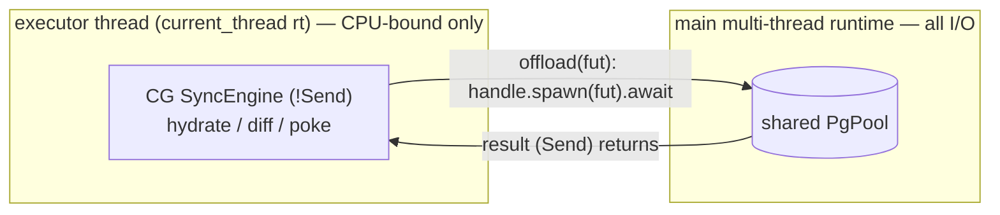
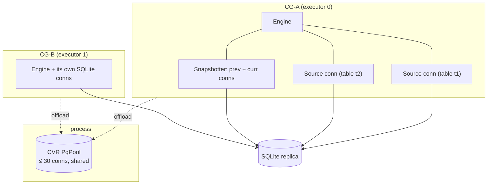
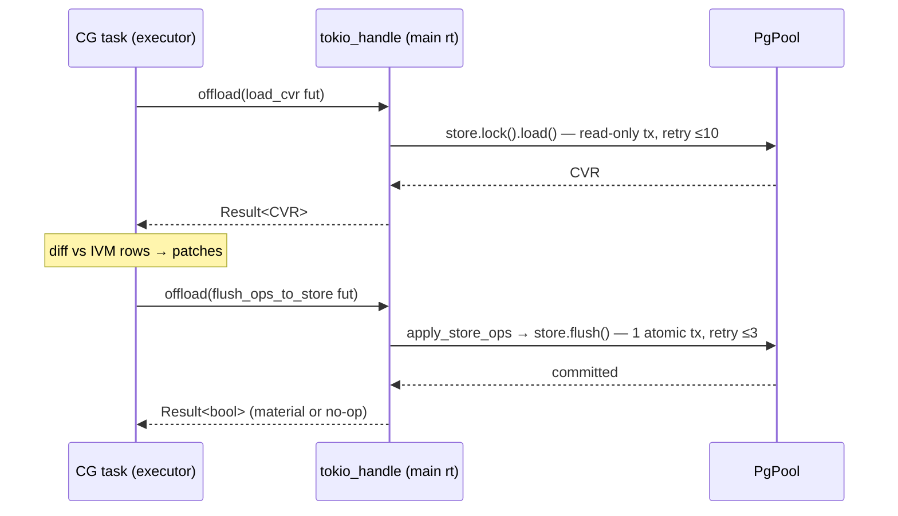
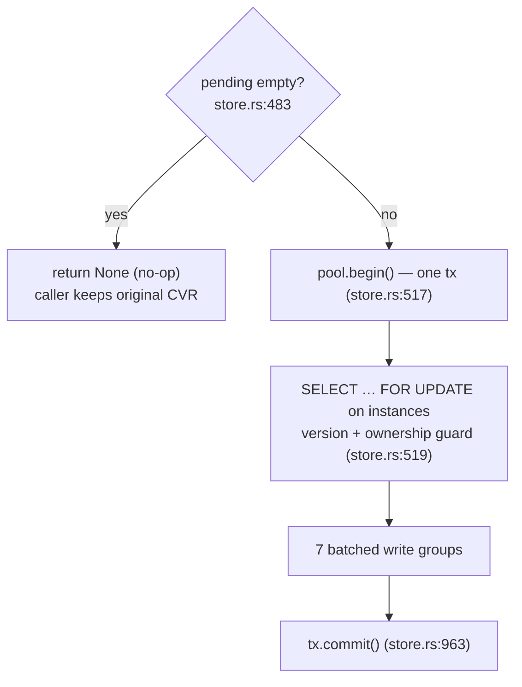
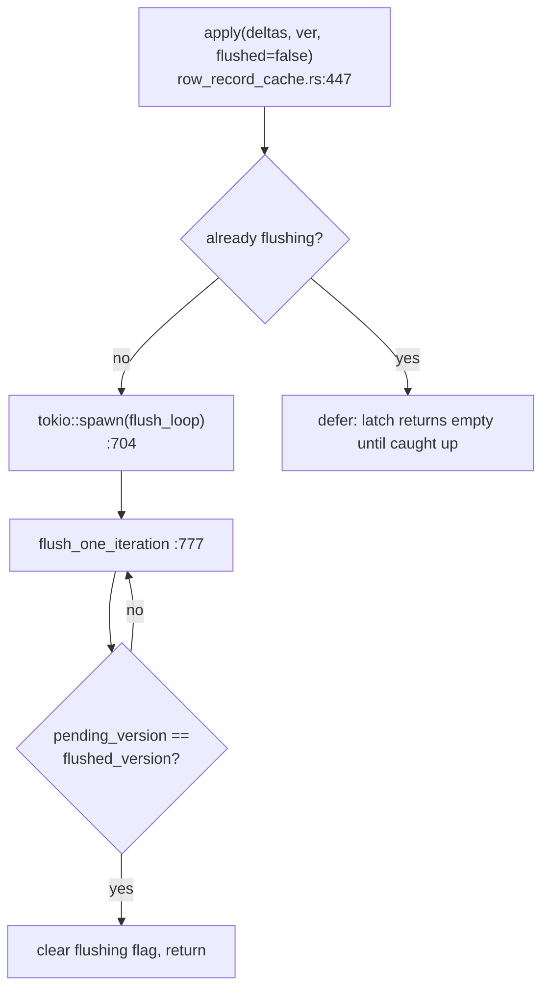
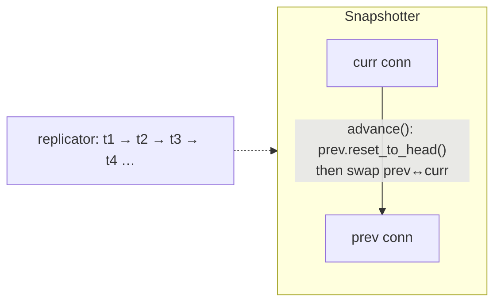

# Rust Syncer — Database Connections & the Offload Model

> **Companion to** [`RUST-SYNCER-ARCHITECTURE.md`](./RUST-SYNCER-ARCHITECTURE.md) (§3, §10).
> This doc traces, at code level, **how the two databases are connected to and how I/O is kept off the compute threads**. It is the "why" behind the two-runtime design.
>
> Branch `rust-cvr-v1.0.0`. Line numbers are anchors — grep the named function if one moved.

---

## Table of contents

1. [The problem the offload model solves](#1-the-problem-the-offload-model-solves)
2. [Connection inventory (the whole picture)](#2-connection-inventory-the-whole-picture)
3. [Postgres: the one shared pool](#3-postgres-the-one-shared-pool)
4. [`SyncEngine::offload` — every call site](#4-syncengineoffload--every-call-site)
5. [CVR load path (read)](#5-cvr-load-path-read)
6. [CVR flush path (write)](#6-cvr-flush-path-write)
7. [Row-record cache: async write-behind](#7-row-record-cache-async-write-behind)
8. [SQLite: replica reads & the Snapshotter](#8-sqlite-replica-reads--the-snapshotter)
9. [Pool observability](#9-pool-observability)
10. [Failure & timeout matrix](#10-failure--timeout-matrix)

---

## 1. The problem the offload model solves

Each client group runs on a **`current_thread` executor** (`main.rs:429` builds the main runtime; `router.rs:3204` builds the per-executor `current_thread` runtimes). That thread **serializes** all the CGs placed on it.

If that thread were to *directly poll* a `sqlx` Postgres connection, then any slow acquire or slow query would **block the executor thread**, and every other client group on that shard would stall behind it. The design doc calls this the **"§5.1 cross-runtime starvation"** hazard. From `main.rs:426-428`:

> *"…the CG executors are current_thread runtimes that must not poll another reactor's connections — doc 91 §5.1."*

The fix, in one picture:



The `SyncEngine` stays pinned and single-threaded; only **`Send + 'static` I/O futures** cross to the main runtime, where a real multi-thread reactor drives them. The executor thread `.await`s a `JoinHandle` (cheap, `Send`, cross-runtime-safe) instead of the connection itself.

```rust
// sync_engine.rs:153
async fn offload<F, T>(&self, fut: F) -> T
where F: Future<Output = T> + Send + 'static, T: Send + 'static
{
    match &self.tokio_handle {
        Some(handle) => handle.spawn(fut).await.unwrap_or_else(|e| panic!("CVR I/O task panicked: {e}")),
        None => fut.await, // unit tests: no handle → run inline
    }
}
```

---

## 2. Connection inventory (the whole picture)

| Connection | DB | Driver | Count | Owned by | Polled by | Mode |
|---|---|---|---|---|---|---|
| CVR pool conns | Postgres | `sqlx` | up to `cvr_max_conns` (default **30**) | **one process-wide pool** | main runtime | read + write |
| IVM source conn | SQLite | `rusqlite` | **one per Source** (≈ per table per CG) | the CG's Engine | executor thread | read-only |
| Snapshotter conns | SQLite | `rusqlite` | **2 per CG** (prev + curr, leapfrog) | the CG's Snapshotter | executor thread | read-only, `BEGIN CONCURRENT` |



**Key asymmetry:** Postgres is **shared** (one pool, any conn serves any CG); SQLite is **per-CG** (each CG opens its own read-only connections into the same replica file). SQLite reads are cheap and local, so per-CG connections are fine; Postgres connections are scarce, so they're pooled globally.

---

## 3. Postgres: the one shared pool

Built **once**, on the main runtime, before any CG exists (`main.rs:464-499`):

```rust
// main.rs:466
let cvr_pool = runtime.block_on(async {
    let opts = || sqlx::postgres::PgPoolOptions::new()
        .max_connections(budget)                       // budget = CVR_MAX_CONNS.max(1), default 30
        .acquire_timeout(Duration::from_secs(10));
    match opts().connect(&config.cvr_pg_uri).await {
        Ok(pool) => pool,                              // eager connect (warms 1 conn)
        Err(e) => {                                    // CVR down at boot?
            tracing::error!("CVR pool eager connect failed ({e}); using lazy pool");
            opts().connect_lazy(&config.cvr_pg_uri).expect("build lazy CVR pool")
        }
    }
});
```

- **`max_connections`** = the whole worker's CVR budget, one shared pool (not fragmented per executor). This matches TS's one-`cvrDB`-pool-per-worker model.
- **`acquire_timeout` = 10s** — bounds a stalled acquire so a convoy surfaces as a timeout, not a hang.
- **Eager-then-lazy** — a best-effort eager connect warms one connection; if CVR PG is unreachable it falls back to a **lazy** pool and still reports ready. This is deliberate TS parity (TS's `warmupConnections` is wrapped in `Promise.allSettled` and tolerates a CVR-down boot). `/readyz` still reports true health for the load balancer.
- The pool is `Arc`-internal; it's **cloned** to every executor (`main.rs:525`, `router.rs:568`) and to the readyz probe and gauges. All clones share the same connections.

---

## 4. `SyncEngine::offload` — every call site

Three families of CVR I/O are offloaded onto the main runtime. Each returns a `Send` value back to the executor thread.



| # | Method | Line | Future offloaded | Pool op | Returns |
|---|---|---|---|---|---|
| 1 | `existing_rows()` | `sync_engine.rs:119` | `cache.load(); cache.get_row_records()` | read `rows` table | `Arc<RowRecordMap>` (O(1) refcount) |
| 2 | `load_cvr()` | `sync_engine.rs:175` | `store.lock().await.load(last_connect_time)` | read-only tx, ≤10 retries | `Result<CVR, LoadCvrError>` |
| 3 | `flush_to_store()` → `flush_ops_to_store()` | `sync_engine.rs:288` / `:317` | `apply_store_ops(ops)` + `store.flush()` + row-cache write-back | 1 atomic write tx, ≤3 retries | `Result<bool>` |

If `tokio_handle` is `None` (unit tests only), each runs inline — so the same code path is testable without a runtime handoff.

---

## 5. CVR load path (read)

`store.load_once` (`store.rs:1000`) runs a **read-only, `REPEATABLE READ`** transaction:

```sql
-- store.rs:1029
SET TRANSACTION ISOLATION LEVEL REPEATABLE READ READ ONLY;

-- instance + rows-version, one row (store.rs:1036)
SELECT cvr."version", cvr."owner", cvr."grantedAt", rows."version" AS "rowsVersion"
FROM "{schema}".instances AS cvr
LEFT JOIN "{schema}"."rowsVersion" AS rows ON cvr."clientGroupID" = rows."clientGroupID"
WHERE cvr."clientGroupID" = $1;
-- then clients, queries (COALESCE("deleted",false)=false), desires — same snapshot
```

Two important behaviors:

- **Rows-behind retry** (`store.rs:1003-1015`, `:1116-1126`) — if the `rowsVersion` lags the CVR `version` (a previous owner hasn't flushed its pending row writes yet), it returns `RowsVersionBehind` and retries **up to 10 times, 500ms apart**. This waits out an in-flight write-behind from the prior owner instead of serving a torn view.
- **Ownership lease** (`store.rs:548-556`) — rejects the load only if *another* task owns the CVR **and** its lease is still live (`grantedAt > last_connect_time`). After a successful read it fires a best-effort ownership `UPDATE` (`store.rs:1258-1273`) to signal the previous owner to stop — this is how ownership hands over on reconnect (TS parity).

---

## 6. CVR flush path (write)

`store.flush` (`store.rs:467`) is **one synchronous atomic transaction** — but remember it runs *on the main runtime via offload*, so it never blocks the CG's executor thread.



The seven write groups, all batched via `json_to_recordset()` (one statement instead of N):

1. **Instance upsert** (`:567`) — `ON CONFLICT DO UPDATE`, re-asserts owner/grantedAt
2. **Clients insert** (`:610`)
3. **Clients delete** (`:637`) — `= ANY($2)`
4. **Query full upserts** (`:651`)
5. **Query partial updates** (`:715`) — per-column `CASE WHEN "<col>Set"` guards
6. **Desire upserts** (`:772`) — dual-writes deprecated INTERVAL columns for upgrade safety
7. **Row upserts + hard deletes** (`:838`) — `json_to_recordset` join on `(schema, table, rowKey)`

Guards that abort the flush before writing: **materiality check** (`:483`, empty pending → `None`), **`FOR UPDATE` lock** on the instance row (`:532`), and **version + ownership** checks (`:548-563`). The whole `flush_ops_to_store` wrapper retries a failed flush **up to 3 times** with exponential backoff (~100/200ms + jitter).

---

## 7. Row-record cache: async write-behind

Row records get an **additional** async path so a large hydrate's row writes don't sit in the flush transaction. `RowRecordCache` (`row_record_cache.rs`) holds:

- `cache` — the in-memory row records, loaded once per CG
- `pending` — writes not yet in Postgres
- `pending_rows_version` vs `flushed_rows_version` — queued vs on-disk watermarks



`flush_one_iteration` (`row_record_cache.rs:777`) transaction:

```sql
BEGIN;  -- READ COMMITTED (default)
SET LOCAL statement_timeout = 0;                      -- no cap on a big write
SET LOCAL idle_in_transaction_session_timeout = 60000; -- but don't hold idle >60s
-- upsert rowsVersion
-- per-row DELETE  ← NOT batched (one round-trip per deleted row) — known inefficiency, matches TS
-- bulk INSERT via json_to_recordset  ← batched
COMMIT;
```

- **Write-back latch** — once flushing starts, deferred `execute_row_updates(allow_defer)` calls return empty until the loop catches up, so writes coalesce.
- **Deferred threshold** = 100 rows (`row_record_cache.rs`) — small batches flush inline with the CVR tx; large ones go async.
- **The per-row DELETE** is the one place batching wasn't applied (INSERTs are batched). It's a documented inefficiency kept for TS parity, and a candidate optimization.

> **Net picture of "sync vs async" for CVR writes:** the CVR *instance/clients/queries/desires* flush is a synchronous atomic transaction (offloaded off the serving thread); *row records* additionally use an async write-behind loop. Historically a synchronous **inline** CVR write on the serving thread caused hydrate stalls — the offload + write-behind split is the fix.

---

## 8. SQLite: replica reads & the Snapshotter

The replica is read-only and local; each CG opens its own connections.

### Source connections

Each IVM `Source` opens **one** `rusqlite` connection (`ivm/source.rs:208-232`):

```rust
// flags — read-only, no per-connection mutex, URI filenames
SQLITE_OPEN_READ_ONLY | SQLITE_OPEN_NO_MUTEX | SQLITE_OPEN_URI
// then:
busy_timeout(5000ms); PRAGMA query_only = ON; PRAGMA case_sensitive_like = ON;
```

A fetch (`ivm/source.rs:666`) builds SQL via `build_select_query()` (`sqlite/query_builder.rs:56`), prepares a statement, and maps each row to an IVM `Arc<Row>` (`FxHashMap`), coercing each column with `sqlite_value_to_ivm()` to respect the schema's declared type (bool/json read identically to TS).

### The Snapshotter (leapfrog)

To read a **consistent** view while the replicator keeps writing, the Snapshotter (`snapshotter/snapshotter.rs:35`) keeps **two** connections, each holding an open `BEGIN CONCURRENT` read transaction, and leapfrogs them on each advance:



- **`advance()`** (`snapshotter.rs:129-175`): take the old `prev`, `reset_to_head()` it (ROLLBACK its tx, `BEGIN CONCURRENT`, read `_zero.replicationState`), then `prev = curr; curr = next`. Never more than **2** connections allocated — reuse avoids the cost of opening + pragma + `BEGIN CONCURRENT` on every frame.
- The diff between the two snapshots is derived from the append-only, version-addressed `_zero.changeLog2`.
- **WAL2 required** (`snapshotter.rs:515-521`) — `PRAGMA journal_mode` must be `wal2` (plain WAL only in tests).
- **Interrupt handles** (`snapshotter.rs:59-82`) — `rusqlite::install_interrupt()` handles are published in a registry after every swap, so a cancel from another thread always hits the *live* connection (used to abort a long advance).

During advance, sources are pointed at the **PREV** snapshot for fetch consistency and swapped to **CURR** after all changes are processed (`engine/mod.rs:919-922`).

---

## 9. Pool observability

The CVR pool is the prime capacity-cliff suspect, so it's gauged (`metrics.rs:613-633`, registered at `main.rs:499`):

| Gauge | Source |
|---|---|
| `zero.sync.cvr.pool-connections` | `pool.size()` — live connections |
| `zero.sync.cvr.pool-idle-connections` | `pool.num_idle()` — idle connections |

These are OTLP `ObservableGauge`s that fire on collector scrape. Without them an acquire convoy is invisible until it becomes 10s-timeout `fail_group`s.

---

## 10. Failure & timeout matrix

| Path | Isolation | Batching | Retry | Timeout |
|---|---|---|---|---|
| CVR load | `REPEATABLE READ` read-only | per-query | **10 × 500ms** (rows-behind) | 10s acquire |
| CVR flush | `READ COMMITTED` | 7 × `json_to_recordset` | **3 ×** backoff | 10s acquire |
| Row write-behind | `READ COMMITTED` | bulk INSERT / per-row DELETE | fail-fast | `statement_timeout=0`, `idle_in_tx=60s` |
| SQLite source fetch | snapshot / `query_only` | single prepared stmt | none | 5s busy |
| Snapshotter advance | `BEGIN CONCURRENT` read | — | none | interrupt-cancellable |

**Invariants to preserve:**

1. **One shared PgPool per worker.** Offload keeps its connections off the `current_thread` executors — never `pool.begin()` directly on a CG thread.
2. **New CVR I/O goes through `offload`.** Inline CVR I/O on the serving thread reintroduces the hydrate-stall regression.
3. **SQLite stays read-only + per-CG.** Sources and Snapshotter connections never write; the replica is owned by the replicator.
4. **Snapshotter is exactly two connections, leapfrogged.** Don't allocate per-frame.
