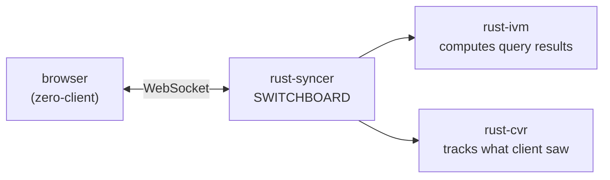
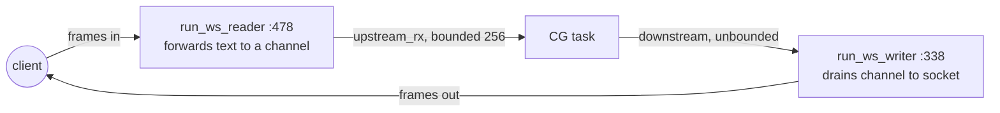
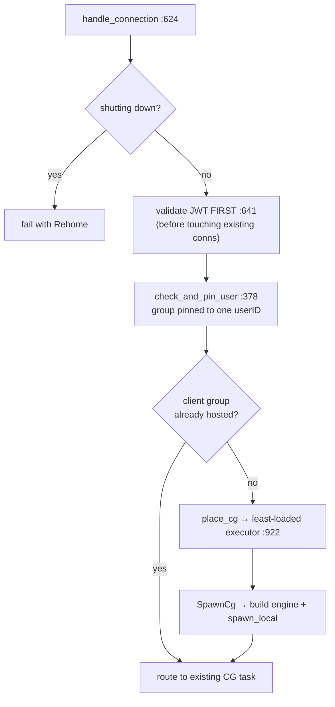
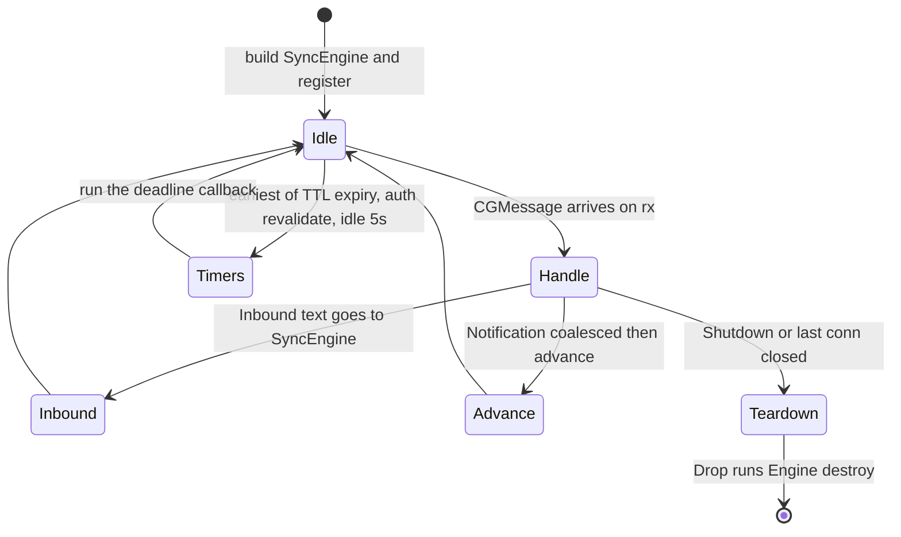
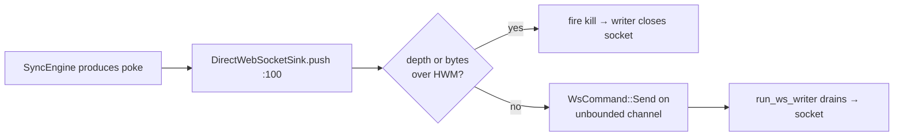
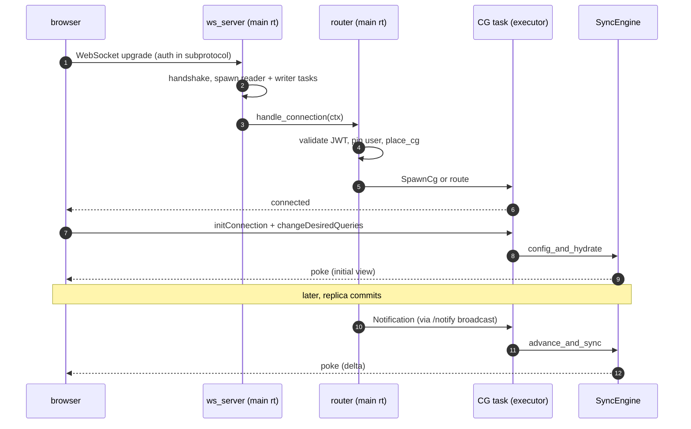

# rust-syncer — Deep Dive

> **Companion to** [`RUST-SYNCER-ARCHITECTURE.md`](./RUST-SYNCER-ARCHITECTURE.md).
> The architecture guide is the whole system at a glance. This doc zooms into the **`rust-syncer` crate** itself — the front door — and explains every stage of a connection's life, intuitively, with real code.
>
> Branch `rust-cvr-v1.0.0`. Line numbers are anchors; grep the named symbol if one moved.

---

## Table of contents

1. [What this crate is (the intuition)](#1-what-this-crate-is-the-intuition)
2. [Module map](#2-module-map)
3. [The protocol — how client and server talk](#3-the-protocol--how-client-and-server-talk)
4. [Stage 1: accepting a WebSocket](#4-stage-1-accepting-a-websocket)
5. [Stage 2: routing & admission](#5-stage-2-routing--admission)
6. [Stage 3: the client-group task](#6-stage-3-the-client-group-task)
7. [Stage 4: message dispatch](#7-stage-4-message-dispatch)
8. [Stage 5: the SyncEngine (what actually computes)](#8-stage-5-the-syncengine-what-actually-computes)
9. [Stage 6: pokes going out](#9-stage-6-pokes-going-out)
10. [Cross-cutting: auth, permissions, drain, metrics](#10-cross-cutting-auth-permissions-drain-metrics)
11. [The whole picture](#11-the-whole-picture)

---

## 1. What this crate is (the intuition)

Think of `rust-syncer` as a **switchboard operator** for a subscription service.

Clients (browsers) call in over WebSocket and say *"I want to watch these queries."* The syncer's job is **not** to compute the answers itself — that's the IVM engine and the CVR store. Its job is everything **around** that:

- pick up the call (accept the WebSocket),
- verify who's calling (auth),
- connect them to the right operator (route to their client-group task),
- translate their requests (parse the protocol),
- hand the real work to the engine,
- and keep pushing updates back down the line (pokes).

Everything in this crate is plumbing and lifecycle. The two crates it orchestrates — `rust-ivm` (the query engine) and `rust-cvr` (the seen-state store) — do the actual thinking.



---

## 2. Module map

The crate is ~20.7k LOC. Grouped by job:

| Group | Files | Job |
|---|---|---|
| **Transport** | `ws_server.rs`, `ws_sink.rs`, `connection.rs`, `connect_params.rs` | WebSocket accept, read/write tasks, per-connection sink |
| **Routing** | `router.rs` (5.3k LOC), `drain.rs` | Place client groups on executor threads, route messages, drain |
| **Protocol** | `protocol.rs`, `message_handler.rs` | Parse upstream messages, format downstream, dispatch |
| **Engine bridge** | `sync_engine.rs` (2.7k LOC), `pipeline_driver.rs` | Drive IVM + CVR; the hydrate/advance hot path |
| **Auth/authz** | `auth.rs`, `permissions.rs`, `connection_context.rs` | JWT validation, read-permissions, user pinning |
| **Queries** | `custom_query.rs`, `query_covering.rs`, `replica_schema.rs` | Custom-query transform, covering analysis, replica introspection |
| **Mutations** | `push_relay.rs` | Relay custom pushes to the TS endpoint (no mutation logic here) |
| **Observability** | `metrics.rs`, `otel.rs`, `http_server.rs`, `trace.rs`, `live_count.rs`, `e2e_serving_lag.rs` | Metrics, OTLP, `/statz` `/readyz` `/notify`, leak census |
| **Entry** | `main.rs`, `lib.rs` | Config from env, runtime + pool + executors, wiring |

---

## 3. The protocol — how client and server talk

The wire format is JSON arrays: `[tag, body]`. The syncer parses incoming ones into an `Upstream` enum (`protocol.rs:644`):

```rust
pub enum Upstream {
    InitConnection(Value),        // "I'm here — set up my client group"
    ChangeDesiredQueries(Body),   // "here are the queries I want to watch"
    UpdateAuth(Value),            // "here's a fresh JWT"
    DeleteClients(Value),         // "forget these clients of mine"
    Push(Body),                   // custom mutation (relayed, not run)
    AckMutationResponses(Body),   // "I got those mutation results"
    Inspect(Value),               // debug/inspector protocol
    Ping,                         // (handled lower down)
    Pull(Value), CloseConnection, // deprecated / no-op
}
```

Going the other way, the server sends **downstream** messages. The important ones:

- `connected` — handshake ack (carries `wsid`, `appId`, `shardNum`).
- `pokeStart` / `pokePart` / `pokeEnd` — the **poke**: a batch of row/query patches that updates the client's view. This is the whole point of the system.
- `error` — a typed error. The `ErrorKind` enum (`protocol.rs:32`) is worth knowing because the *kind* tells the client what to do:

| ErrorKind | Client reaction |
|---|---|
| `Rehome` / `Rebalance` | reconnect (maybe to another instance) — used on drain & slow-client shed |
| `Unauthorized` / `AuthInvalidated` | re-auth |
| `VersionNotSupported` | hard stop, incompatible |
| `ClientNotFound` / `InvalidConnectionRequest*` | reset local state |
| `Internal` | generic failure |

> **Intuition:** the protocol is deliberately small. Almost all traffic is one direction — the client subscribes once, then the server streams pokes forever. The `ErrorKind` is how the server tells a client *how to recover* without a human in the loop.

---

## 4. Stage 1: accepting a WebSocket

`ws_server.rs:accept_connection` (`:112`) does the handshake and then splits the socket into **two independent tokio tasks**. This split is the key transport idea:



Why two tasks? A socket can be read and written **at the same time**. The reader only ever pushes client messages onto a channel; the writer only ever drains poke frames onto the socket. Neither blocks the other, and neither blocks the CG that does the real work.

Three safety valves live in the writer (`run_ws_writer`):

- **Slow-client shed** — if the downstream queue exceeds a frame count (4096) or byte budget (256MB), a `watch` kill signal fires and the socket is closed with a `Rehome` error. Protects process memory against a stalled client (`ws_server.rs:355`).
- **Liveness** — a client silent for 60s (12 missed 5s pings) is closed rather than buffering pokes against a dead socket (`:421`).
- **Keepalive pong** — if nothing's been sent downstream for 6s, send a pong so the client knows we're alive (`:441`).

The handshake also does one easy-to-miss thing: it **echoes the client's `Sec-WebSocket-Protocol`** back (`:148`). The client smuggles its `initConnection`/auth in that subprotocol header, and per RFC 6455 it aborts if the server doesn't select one. Miss this and *nothing* connects.

The result of accepting is a `ConnectionContext` (params + sink + the upstream receiver), handed to the router.

---

## 5. Stage 2: routing & admission

`router.rs:handle_connection` (`:624`) runs on the **main runtime** (because auth may do a JWKS HTTP fetch). It's the bouncer. In order:



Three things worth understanding here:

**Auth goes first, deliberately** (`:641`). Validating the JWT *before* touching any existing connection means an unauthenticated attacker can't force-disconnect a real user by opening a socket with their client id. Security-critical ordering.

**User pinning** (`check_and_pin_user`, `:378`). A client group is bound to the **first** userID that connects to it. A later connection claiming a different user is rejected — a client group belongs to exactly one user.

```rust
fn check_and_pin_user(group: &mut GroupAuthState, incoming: &str) -> Result<(), ()> {
    match group.pinned_user_id.clone() {
        Some(pinned) if pinned != incoming => Err(()), // different user → reject
        Some(_) => Ok(()),                             // same user → allow
        None => { group.pinned_user_id = Some(incoming.to_string()); Ok(()) } // first → bind
    }
}
```

**Placement** (`place_cg`, `:922`) — covered in depth in the architecture doc (§4). The one-liner: a new client group is put on the **least-loaded executor thread** and pinned there for life, because its IVM engine is `!Send`.

---

## 6. Stage 3: the client-group task

Once placed, a client group lives as a `spawn_local` task — `cg_event_loop` (`router.rs:3345`) — on its executor thread. This is the heart of a CG's life. It's a loop that waits on **either** an incoming message **or** one of three deadline timers:



The messages it handles (`CGMessage`):

| Message | Meaning | Leads to |
|---|---|---|
| `NewConnection` | a socket joined this group | register client, maybe hydrate |
| `Inbound` | a client sent a protocol message | dispatch (§7) |
| `Notification` | the replica committed new data | **advance** + poke |
| `ConnectionClosed` | a socket dropped | unregister; maybe idle-teardown |
| `Shutdown` | drain | fail sockets with Rehome, exit |

Two behaviors matter:

**Notification coalescing** (`:3500`). If commits arrive faster than the CG can process, the loop drains all queued `Notification`s with `try_recv()` and merges them into **one** advance (keeping the oldest commit time). This is what keeps a busy CG from falling behind — it processes the newest state, not every intermediate one.

**Deadline multiplexing.** Instead of separate timers, the loop computes the *single earliest* deadline across TTL query-eviction, periodic auth re-validation, and idle shutdown, and `select!`s on that one sleep. Efficient: one timer, not three.

---

## 7. Stage 4: message dispatch

When an `Inbound` message reaches the CG, it's parsed and dispatched. The reference dispatch is `SyncerWsMessageHandler::handle_message` (`message_handler.rs:198`) — this is the clearest single view of "what each message does":

```rust
match parsed {
    Upstream::ChangeDesiredQueries(body) => {          // client changed its queries
        self.view_syncer.change_desired_queries(selector, msg);
    }
    Upstream::UpdateAuth(_) => {                         // fresh JWT
        let changed = self.conn_context_manager.update_auth(selector, &body_value);
        self.view_syncer.update_auth(selector, msg, changed);
    }
    Upstream::DeleteClients(_) => {                      // forget clients
        let deleted = self.view_syncer.delete_clients(selector, msg);
        if let Some(pusher) = &self.pusher { pusher.delete_client_mutations(...); }
    }
    Upstream::InitConnection(_) => {                     // set up client group
        self.conn_context_manager.init_connection(selector, &body_value);
        let accepted = self.view_syncer.init_connection(selector, msg);
        if accepted { if let Some(pusher) = &self.pusher { pusher.init_connection(selector); } }
    }
    Upstream::Push(body) => self.handle_push(selector, &body, msg), // relayed
    Upstream::AckMutationResponses(body) => { /* pusher.ack... */ }
    Upstream::Inspect(_) => self.view_syncer.inspect(selector, msg),
    Upstream::Ping | Upstream::Pull(_) | Upstream::CloseConnection => { /* no-op / error */ }
}
```

> **A subtlety noted in the code** (`message_handler.rs:263`): in the full binary, the **router intercepts** `initConnection` / `changeDesiredQueries` / `updateAuth` / `deleteClients` on the CG thread *before* they reach this handler — so those arms don't double-fire in production. This handler remains the self-contained, unit-tested reference for what each message means. The two paths trigger the same side effects.

The mental model: each message either **changes what the client wants** (queries/auth) or **acknowledges/relays** something. The ones that change what's wanted trigger a hydrate; the replica changing triggers an advance. Both end in a poke.

---

## 8. Stage 5: the SyncEngine (what actually computes)

The dispatch calls into the `SyncEngine` (`sync_engine.rs`) — the `!Send` object that owns this CG's slice of the world (its IVM pipelines, CVR store handle, row cache, and client sinks). This is where "what the client wants" meets "what the data is."

Two entry points, both covered in detail in [Architecture §7](./RUST-SYNCER-ARCHITECTURE.md#7-the-syncengine-hot-path--hydrate--advance--diff--poke):

- **`config_and_hydrate`** (`:454`) — a client subscribed to new queries → run them through IVM, diff the full result against the CVR, poke the difference.
- **`advance_and_sync`** (`:1255`) — the replica committed → push the delta through IVM, diff, poke.

The syncer's role is just to **call** these at the right time and route the resulting pokes back to the right sockets. The *how* of hydrate/diff/poke lives in the engine + CVR (see [`RUST-CVR-DEEP-DIVE.md`](./RUST-CVR-DEEP-DIVE.md) for the diff/CVR half).

---

## 9. Stage 6: pokes going out

A poke is produced by the engine and flows back to the client through the `DirectWebSocketSink` (`ws_sink.rs`). The sink turns a JSON value into a `WsCommand` on the unbounded downstream channel:

```rust
pub enum WsCommand {
    Send { msg: Value, est_bytes: usize },  // a frame to write
    Fail(ErrorBody),                          // send error then close
    Close(String),                            // graceful close
}

pub fn push(&self, msg: Value) {              // ws_sink.rs:100
    let est_bytes = estimate_json_bytes(&msg);
    let _ = self.send_command(WsCommand::Send { msg, est_bytes });
}
```

`send_command` does the backpressure accounting: it atomically bumps a depth counter and a byte counter, and if either crosses its HWM it fires the kill signal (slow-client shed). The byte estimate is recorded here at enqueue and subtracted by the writer at dequeue — **symmetric accounting** so the gauges can't drift.



Why unbounded? Because poke frames **must stay in order** (`pokeStart → pokePart* → pokeEnd`). An unbounded channel preserves order; memory is bounded by the shed policy instead of by the channel. This is a documented, deliberate choice (a bounded channel could reorder or drop under load).

---

## 10. Cross-cutting: auth, permissions, drain, metrics

- **Auth** (`auth.rs`) — JWT validation with `jsonwebtoken`, JWKS fetch+cache (300s TTL, 30s refetch cooldown). Precedence `jwk → secret → jwksUrl`. Note the parity fixes: `validate_nbf=true`, `leeway=0` (see the parity doc).
- **Permissions** (`permissions.rs`) — rewrites each query's AST to enforce read-permissions. **Fail-closed**: if the deployed permissions doc exists but won't load, it substitutes deny-all rather than serving unfiltered rows.
- **Drain** (`drain.rs`, `main.rs:621`) — on SIGTERM, client groups are Rehomed one per interval so receiving instances absorb reconnects gradually; SIGINT is an immediate shutdown. A second signal expedites.
- **Metrics** (`metrics.rs`, `otel.rs`) — process-wide counters (hydrations, advances, latencies, CVR pool gauges) exported via OTLP to the same collector as TS. Read by `/statz`; `/readyz` reports true CVR+replica health.
- **`/notify`** (`http_server.rs`) — the HTTP endpoint the replicator hits on each commit; it broadcasts a `Notification` to every CG (which then advances + pokes).

---

## 11. The whole picture

Putting all six stages together:



**One-line summary:** `rust-syncer` is the lifecycle and plumbing layer — accept, authenticate, route, parse, and stream — that turns a raw WebSocket into a live query subscription, delegating all computation to `rust-ivm` and `rust-cvr`.

**Next:** [`RUST-CVR-DEEP-DIVE.md`](./RUST-CVR-DEEP-DIVE.md) — the other half: how the CVR store decides *what the poke should contain*.
