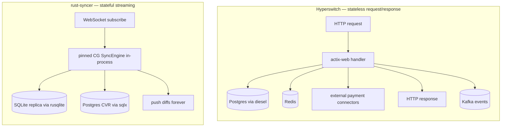

# Rust Syncer vs. Hyperswitch — Library & Stack Comparison

> **Companion to** [`RUST-SYNCER-ARCHITECTURE.md`](./RUST-SYNCER-ARCHITECTURE.md).
> A benchmark of our Rust stack against **[Hyperswitch](https://github.com/juspay/hyperswitch)** — Juspay's mature, production, open-source Rust payments platform — to sanity-check our library choices against a battle-tested peer.
>
> Sources: [hyperswitch `router` Cargo.toml](https://github.com/juspay/hyperswitch/blob/main/crates/router/Cargo.toml), [hyperswitch-card-vault Cargo.toml](https://github.com/juspay/hyperswitch-card-vault/blob/main/Cargo.toml). Versions as of August 2026.

---

## 1. Read this first — the two are opposite-shaped

A naive "they use X, we should too" reading is misleading, because the two systems solve inverse problems:



| | **Hyperswitch** | **rust-syncer** |
|---|---|---|
| Shape | stateless, horizontally scaled | stateful, in-process graph |
| Lifecycle | short req/resp | long-lived streaming socket |
| Where state lives | Postgres + Redis (external) | the IVM graph, pinned to a thread |
| Scaling unit | replicas behind a LB | client groups across executor threads |

So different libraries are the *correct* outcome, not drift. This doc separates **"same problem, same choice"** (validation) from **"different problem, different choice"** (justified) from **"worth borrowing"** (action).

---

## 2. Side-by-side by category

| Concern | **Hyperswitch** (`router`) | **rust-syncer** (3 crates) | Verdict |
|---|---|---|---|
| **Async runtime** | `tokio` 1.48, multi-thread | `tokio` (full): main multi-thread + K `current_thread` executors | 🟰 same core, we run a two-runtime topology |
| **HTTP framework** | `actix-web` 4.11 (+cors/http/multipart) | `axum` 0.7 — only `/statz` `/readyz` `/notify` | ↔ HTTP is their product; a side-channel for us |
| **Primary transport** | HTTP / REST | `tokio-tungstenite` 0.24 (WebSocket) | ↔ req/resp vs push |
| **Postgres** | `diesel` 2.2 ORM + `async-bb8-diesel` + `bb8` | `sqlx` 0.8 (async, no ORM, hand-written SQL) | ↔ ORM vs tuned raw SQL |
| **Embedded DB** | — | `rusqlite` 0.32 (SQLite replica) | ✚ unique to us |
| **HTTP client** | `reqwest` 0.11 (json, rustls, gzip, multipart) | `reqwest` 0.12 (json, rustls) | 🟰 same lib, we're a minor newer |
| **JWT auth** | `jsonwebtoken` 9.3 + `josekit` | `jsonwebtoken` 9 | 🟰 same lib |
| **Serialization** | `serde` + `serde_json` + `serde_qs` + `serde_path_to_error` | `serde` + `serde_json` (`preserve_order`, `rc`) | 🟰 same core, they add helpers |
| **Error handling** | `error-stack` 0.4 + `thiserror` 1.0 | `thiserror` 2 + `Result<_, String>` on hot paths | ⚠️ they carry richer context — see §4 |
| **Telemetry** | `tracing` + `tracing-futures` + OTel via `router_env` | `tracing` + `opentelemetry` + `opentelemetry-otlp` 0.32 | 🟰 both OTLP |
| **Redis / queue** | `redis_interface` (redis-rs/fred) + `rdkafka` (Kafka) | none | ↔ we keep state in-process |
| **Concurrency prims** | `bb8` pool + actix internals | `dashmap`, `parking_lot`, `Arc<Atomic*>`, `Rc<RefCell>` | ↔ pool-shaped vs actor/graph-shaped |
| **Hashing** | `blake3`, `sha2` (crypto) | `rustc-hash` (FxHashMap), `xxhash-rust` (xxh32) | ↔ security vs speed hashing |
| **Crypto** | `ring`, `argon2`, `hkdf`, `rustls`, `openssl` | `rustls` (via reqwest) only | ↔ they hold card data; we don't |
| **Memory profiling** | — (prod OTel) | `dhat` (heap) + `libc::malloc_trim` | ✚ our G6-leak history drove this |
| **Product extras** | `utoipa` (OpenAPI), `tera`, `csv`, `totp-rs`, `uuid` | `regex-lite`, `tiny_http`, `async-trait` | ↔ their extras are payment features |

Legend: 🟰 same choice · ↔ different but justified · ✚ unique to us · ⚠️ gap worth closing

---

## 3. The interesting deltas explained

**`actix-web` vs `axum`.** Hyperswitch's entire surface is a high-throughput REST API, so actix's raw performance and mature middleware matter. We expose four operational endpoints, so axum's smaller footprint (and its clean tower/tokio integration) is the better fit. Neither is wrong; the choice tracks how central HTTP is.

**`diesel` (ORM) vs `sqlx` (raw async).** Diesel gives compile-time-checked schema, a query DSL, and migrations — ideal for a stable relational domain with many tables. Our CVR writes are hand-tuned in ways an ORM fights: `json_to_recordset` batch upserts, `FOR UPDATE` ownership guards, `SET LOCAL statement_timeout`, per-column `CASE WHEN "<col>Set"` partial updates (see [`RUST-SYNCER-DB-AND-OFFLOAD.md`](./RUST-SYNCER-DB-AND-OFFLOAD.md) §6). sqlx's async, raw-SQL model lets us write exactly that.

**Redis + Kafka vs nothing.** Because Hyperswitch is stateless it *must* externalize cache and events. Our whole value proposition is the opposite — the IVM graph is stateful and lives in the process, pinned to a thread. Adding a Redis/Kafka hop would defeat the design.

**Speed hashing vs crypto hashing.** They use `blake3`/`sha2` because they hash secrets and card data. We use `rustc-hash` (`FxHashMap`) and `xxhash` on the hydrate/diff hot path, where the input is trusted and the only goal is throughput.

---

## 4. Worth borrowing from Hyperswitch

Two of their choices are low-risk upgrades that fit problems we already have:

### 4.1 `error-stack` — contextful errors

Our hot paths thread `Result<_, String>` (e.g. `hydrate_and_sync`, `advance_and_sync`, `store.flush`). A stringly error loses the *where and why* chain, which is exactly what you want when a prod CVR/advance failure needs root-causing. Hyperswitch uses `error-stack` to attach a context stack as an error propagates.

```rust
// today (loses the chain)
store.flush(&expected, &flushed, t).await.map_err(|e| e.to_string())?;

// with error-stack (keeps the chain)
store.flush(&expected, &flushed, t).await
    .change_context(CvrError::Flush)
    .attach_printable_lazy(|| format!("cg={cg_id} version={expected:?}"))?;
```

Payoff: a failure log carries the CG id, version, and the call path — instead of a bare `"…"`. Aligns directly with the failure-telemetry work already in the branch.

### 4.2 `serde_path_to_error` — pinpoint protocol parse failures

When a client sends a malformed upstream message, `serde_json::from_str` reports a generic "expected X at line/col" against the *serialized* form. `serde_path_to_error` reports the **field path** (e.g. `desiredQueries[3].ttl`) that failed. Cheap to wrap around `protocol::parse_upstream` and a real debuggability win for protocol-parity issues.

Both are drop-in, additive, and match things the team already cares about (parity debugging, failure telemetry). Neither changes the runtime model.

> Not recommended to borrow: their `actix-web`/`diesel`/Redis/Kafka stack — those are the parts that are correct *for a stateless payments API* and wrong for a stateful sync engine.

---

## 5. One-line takeaway

We are on the **same core primitives** as a battle-tested Rust production system (`tokio`, `reqwest`, `rustls`, `jsonwebtoken`, `serde`, `tracing`+OTLP, `thiserror`). Every divergence traces to **stateful-streaming vs stateless-request** — and the only two things worth pulling across are **`error-stack`** and **`serde_path_to_error`**, both for debuggability, neither touching the architecture.
